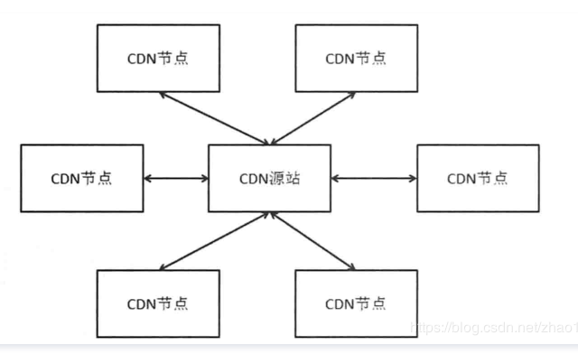

# CDN内容分发网络

#### [CDN](https://cloud.tencent.com/product/cdn?from=10680)加速静态文件访问

- 全局调度
- 缓存技术
- 内容分流
- 带宽优化

```
	CDN是Content Delivery Network的缩写，意思是内容分发网络。CDN的作用是把用户需要的内容分发到离用户近的地方，这样可以使用户能够就近获取所需内容。
	整个CDN系统（如图1-1所示）分为CDN源站和CDN节点，CDN源站提供CDN节点使用的数据源头，而CDN节点则部署在距离最终用户比较近的地方，加速用户对站点的访问。
	CDN其实就是一种网络缓存技术，能够把一些相对稳定的资源放到距离最终用户较近的机房，一方面可以节省整个广域网的带宽消耗，另外一方面可以提升用户的访问速度，改进用户体验。我们一般把一些相对静态的文件（例如图片、视频、JS脚本、一些页面框架）放在CDN中。
```



 我们通过浏览器访问一个网站的过程大致如图1-2所示。


 （1）用户向浏览器提交要访问的域名。 

（2）浏览器对域名进行解析，得到域名对应的IP地址。 

（3）浏览器向所得的IP地址发送请求。 

（4）浏览器根据返回的数据显示网页的内容。

```
而在有了CDN以后，用户通过浏览器访问网站的过程会产生一些变化。如图1-3
```


（1）用户向浏览器提交要访问的域名。

 （2）浏览器对域名进行解析，由于CDN对域名解析过程进行了调整，所以得到的是该域名对应的CNAME记录。

 （3）对CNAME再次进行解析，得到实际IP地址。在这次的解析中，会使用全局[负载均衡](https://cloud.tencent.com/product/clb?from=10680)DNS解析，也就是我们需要返回 具体IP地址，需要根据地理位置信息以及所在的ISP来确定返回的结果，这个过程才能让身处不同地域、连接不同接入商的 用户得到最适合自己访问的CDN地址，才能做到就近访问，从而提升速度。 

（4）得到实际的IP地址以后，向服务器发出访问请求。

（5）CDN会根据请求的内容是否在本地缓存进行不同处理： 1）如果存在，则直接返回结果。 2）如果不存在，则CDN请求源站，获取内容，然后再返回结果。

通过这个流程，我们可以看到CDN中的几个关键技术。

## 全局调度

```
全局调度是完成用户就近访问的第一步，我们需要根据用户地域、接入运营商以及CDN机房的负载情况去调度。前面两个调度因素需要一个尽可能精准的IP地址库，这是正确调用的前提（误识别的IP地址到地理位置的对应可能会把东北的用户调度到华南的站点去），当然，做到100%的精确是不现实的。IP地址库的维护是一个持续和变化的过程，并且调度的策略随着CDN机房的增加也会变化。例如，我们不可能在所有城市都设置CDN机房，假设刚开始河南整个省份没有CDN机房，可能河南靠北的城市使用天津的CDN，同时河南靠南的城市使用湖北的CDN会比较好，而如果后来在郑州市建设了CDN机房的话，那么原来的调度策略就会修改了。CDN的负载也是调度中的一个影响因素，举例来说，如果一个CDN机房举例你的位置比较近，但是它的负载已经很高，响应很慢，那么你的请求送到距离稍远的CDN机房反而会更快。
```

## 缓存技术

```
	从上面的流程中我们看到，如果用户请求的内容不在CDN中的话，CDN会回到源站去加载内容，然后返回给用户。所以，如果CDN机房的请求命中率不高的话，那么起到的加速效果也是相对有限的。
	要提升命中率，就需要CDN机房中有尽可能全面的数据，这要求CDN机房的缓存容量要足够大，我们可以使用“内容+SSD+机械硬盘”的混合存储方式来提升整体的缓存容量，并且我们做好冷热数据的交换，在提升命中率时也尽量降低缓存的响应时间。
	此外，当CDN的Cache没有命中要回源加载数据时，合并同样数据的请求也是一个很重要的优化，这样可以减少重复的请求，降低源站的压力。
	最后，新增、变更数据后的CDN预加载也是一个提升命中率的办法。也就是在没有请求进来时，CDN主动去加载数据，做好准备。当然这个主动加载一般也需要源站有一个通知过来。
```

## 内容分发

```javascript
这里提到的内容分发主要是对内容全部在CDN上不用回源的数据的管理和分发，例如一些静态页面等。具体做法是在内容管理系统中进行编辑修改后，通过分发系统分发到各个CDN的节点上。分发的效率以及对分发文件一致性、正确性的校验是需要关注的点。
```

## 带宽优化

```
CDN提供了内容加速，很多请求和流量都压到了CDN上，那么如何能够比较有效地节省带宽会是一个很重要的事情，因为这直接关系到流量成本。优化的思路是只返回必要的数据、用更好的压缩算法等。
```

在CDN的应用中，从传统意义上来讲，主要是把用户需要访问的内容放到离用户近的地方。可以发现大部分流量是从源站到CDN机房的流量，我们也可以利用CDN机房距离目标用户近的地点，让一些上传的工作从CDN接入，然后再从CDN传到源站 ，这一方面可以提升用户的上传速度，另一方面也很好地利用了从CDN机房到源站的上行带宽。