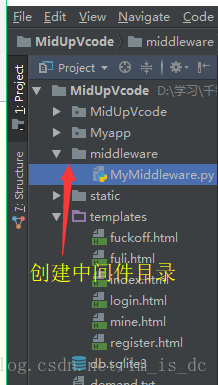

# Django中间件(Middleware)处理请求

#### 1、面向切面编程

- 切点（钩子）
- 切点允许我们动态的在原有逻辑中插入一部分代码
- 在不修改原有代码的情况下，动态注入一部分代码
- 默认情况，不中断传播，切点会自动愈合（自动执行原有逻辑）
- 如果我们执行了中断操作（return，raise），没接上，会直接到程序结尾
- 五个切面：1、请求交给路由处理之前；2、请求交给视图处理之前；3、请求交给视图渲染后；4、渲染结果返回给模板之前；5、出现异常。 2、Django中的中间件

#### 2、Django中的中间件

- init
  - 没有参数，服务器响应第一个请求的时候自动调用，用户确定是否启用该中间件
- process_request(self,request)
  - 在执行视图前被调用，每个请求上都会调用
  - 不返回或返回HttpResponse对象
- process_view(self,request,view_func,view_args,view_kwargs)
  - 调用视图之前执行，每个请求都会调用
  - 不返回或返回HttpResponse对象
- process_template_response(self,request,response)
  - 在视图刚好执行完后进行调用，每个请求都会调用
  - 不返回或返回HttpResponse对象
- process_response(self,request,response)
  - 所有响应返回浏览器之前调用，每个请求都会调用
  - 不返回或返回HttpResponse对象
- process_exception(self,request,exception)
  - 当视图抛出异常时调用
  - 不返回或返回HttpResponse对象

```python
from django.http import HttpResponse
from django.shortcuts import render, redirect
from django.urls import reverse
from django.utils.deprecation import MiddlewareMixin

from MidUpVcode.settings import BLACK_LIST, VIP_LIST
'''
所有的钩子函数都可以返回一个Response
一旦钩子函数返回了Response,整个请求的受理就结束了
'''
# 继承于框架中间件
class MyappMiddleware(MiddlewareMixin):
    # 中间件的初始化方法,全局执行一次
    # def __init__(self, get_response=None):
    #     super(MyappMiddleware, self).__init__()
    #     print(">>>>>>>>>> MyappMiddlware __init__")
    # 下钩子与所有路由被交给路由表之前
    def process_request(self, request):
        # 获取客户端IP地址
        clientIp = request.META['REMOTE_ADDR']
        # 请求的路由
        url = request.path
        print(">>> process_request", request, clientIp, url)
        # # 屏蔽黑名单用户
        # 只要客户端IP在黑名单中
        # if clientIp in BLACK_LIST:
        #     直接渲染fuckoff.html并立刻返回
        #     return render(request,'fuckoff.html')

        # # 当VIP用户访问福利页面时提供更多好的服务
        # if clientIp in VIP_LIST and url=='/myapp/fuli/':
        #     return render(request, 'fuli.html', context={'imgpath': 'meinv1.jpg'})
        # 福利页必须登录了才能查看
        if url == '/myapp/fuli/' and not request.session.get('uname', None):
            return redirect(reverse('myapp:login'))
        # 下钩子于所有路由请求被交给视图函数之前
    def process_view(self, request, view_func, view_args, view_kwargs):
        print(">>> process_view", request, view_func, view_args, view_kwargs)
        # 理论上下钩子于所有路由请求的模板被渲染完成以后
    # 这个函数实测无法回调
    def process_template_response(self, request, response):
        print(">>>>>>>>>> process_template_response", request, response)
        return response

    # 下钩子于所有路由的响应被返回之前
    def process_response(self, request, response):
        print(">>>>>>>>>> process_response", request, response)
        return response

    def process_exception(self, request, exception):
        print(">>>>>>>>>> process_exception", request, exception)
        return redirect('/')

```

####  3、自定义中间件

用途

- 统计
- 黑名单
- 白名单
- 反爬（redis）
- 界面友好化（捕获异常）
- 

流程

- 在工程目录下创建middleware目录

  

 继承MiddleWareMixin 

```python
class LearnAOP(MiddlewareMixin):
    def process_request(self,request):
        print('request的路径',request.GET.path)
```

覆写切点方法，实现自己的功能

- 如果我们逻辑中没有返回值，那么程序执行的时候会按照原有逻辑执行
- 如果我们做出了返回，那么程序将会从切点处切开，直接回到浏览器

 在settings中进行注册 

```python
MIDDLEWARE = [
    ...
    # 注册自定义的中间件
    'middleware.MyMiddleware.MyappMiddleware',
    ...
]
```

Django中间件
