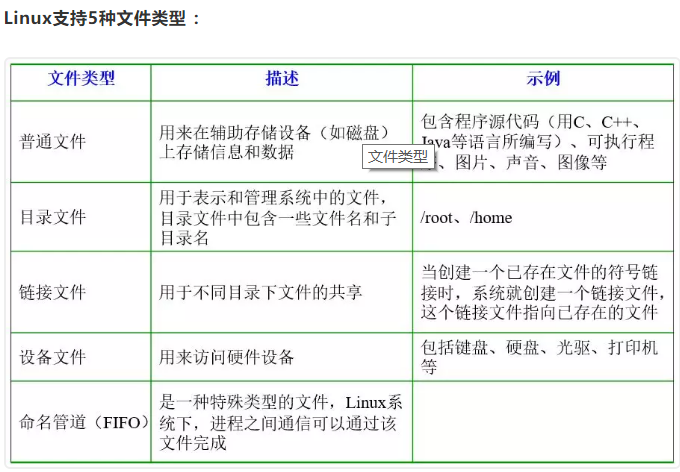

# Linux命令

###### **Linux文件系统简介**

```
																																																				在Linux操作系统中，所有被操作系统管理的资源，例如网络接口卡、磁盘驱动器、打印机、输入输出设备、普通文件或是目录都被看作是一个文件。
也就是说在LINUX系统中有一个重要的概念：一切都是文件。其实这是UNIX哲学的一个体现，而Linux是重写UNIX而来，所以这个概念也就传承了下来。在UNIX系统中，把一切资源都看作是文件，包括硬件设备。UNIX系统把每个硬件都看成是一个文件，通常称为设备文件，这样用户就可以用读写文件的方式实现对硬件的访问。
```

**文件类型与目录结构**



## Linux操作系统主要目录功能

```shell
1、/bin
/bin目录包含了引导启动所需的命令或普通用户可能用的命令(可能在引导启动后)。这些命令都是二进制文件的可执行程序(bin是binary----二进制的简称)，多是系统中重要的系统文件。
2、/sbin
/sbin目录类似/bin，也用于存储二进制文件。因为其中的大部分文件多是系统管理员使用的基本的系统程序，所以虽然普通用户必要且允许时可以使用，但一般不给普通用户使用
3、/etc
/etc目录存放着各种系统配置文件，其中包括了用户信息文件/etc/ passwd，系统初始化文件/etc/rc等。linux正是因为这些文件才得以正常地运行。
4、/root
/root 目录是超级用户的目录
5、/lib
/lib目录是根文件系统上的程序所需的共享库，存放了根文件系统程序运行所需的共享文件。这些文件包含了可被许多程序共享的代码，以避免每个程序都包含有相同的子程序的副本，故可以使得可执行文件变得更小，节省空间
6、/dev
/dev目录存放了设备文件，即设备驱动程序，用户通过这些文件访问外部设备。比如，用户可以通过访问/dev/mouse来访问鼠标的输入，就像访问其他文件一样
7、/usr
/usr 是个很重要的目录，通常这一文件系统很大，因为所有程序安装在这里。本地安装的程序和其他东西在/usr/local 下，因为这样可以在升级新版系统或新发行版时无须重新安装全部程序。
8、/var
/var 包含系统一般运行时要改变的数据。通常这些数据所在的目录的大小是要经常变化或扩充的
9、/home
/home 普通用户的默认目录，在该目录下，每个用户拥有一个以用户名命名的文件夹。
```

## 基础操作命令

```shell
ls 查看当前文件夹下的内容 -l展示详细信息 -a展示隐藏文件[.开头]
pwd 查看当前所在的文件夹
cd[目录名] 切换文件夹 cd:表示回到主目录
touch[文件名] 如果文件不存在，新建文件， touch可以同时跟多个参数，表示创建多个文件
mkdir[目录名] 创建目录 -p可以创建层级目录
rm[文件名] 删除指定的文件名
cp 复制一个文件 如果拷贝一个目录需要加-r,这个命令也有另存为的意思
mv 移动一个文件
clear 清屏
```

## 文件操作

```shell
cat 文件名 查看文件内容，创建文件，文件合并，追加文件内容等功能
head 文件名 显示文件头部
tail 文件名 显示文件尾部 -n表示可查看当前指定n行或者后n行，不加默认查看10行
grep 搜索文本文件名 搜索文本文件内容 -n用于显示行号，-i忽略大小写
find 路径 -name 文件名 查找文件 会从指定目录及其子目录中查询搜索文件
file 文件名 查看文件类型
wc 文件名 查看文件行数，单词数等信息 -c表示查看多少字符，-l查看多少行，-w查看多少单词，如果不加选项则显示这三项
diff 文件1 文件2 对比两个文件差异	
```

## 压缩解压

```shell
zip,unzip 将文件压缩为zip格式/将zip格式文件解压
gzip,gunzip 将文件压缩为gz格式/将gz格式文件解压
bzip2,bunzip2 将文件压缩为bz2格式/将bz2格式文件解压
tar 对gz或者bz2格式进行压缩解压

```

## 权限管理

```shell
sudo 放在一个命令前，表示使用管理员权限执行
chmod 修改文件权限
```

## 显示展示命令

```shell
echo 向终端打印内容 -n表示打印完成不换行
date 显示当前时间
df 显示磁盘剩余空间 -h以M为单位显示，-T显示文件系统类型
whoami 显示当前用户
which 显示执行命令所在位置
输出重定向：
	echo"hello world">out.txt 将执行结果，写到txt文件中，若有同名文件将被删除
	>>是追加
管道：
	ls | grep 'test'
	意味着第一个命令的输出将作为第二个命令的输入，通过管道传递给第二个命令，第二个命令的输出又将作为第三个命令的输入，
```

## 其他命令

```shell
shutdown 关机或者重启 
-r now 立即重启
now 立即关机
+10 10分钟关机
-c 取消关机计划
ln 创建链接
ln : 一般使用  -s 选项 创建软链接，相当于快捷方式，如果跨目录创建要使用绝对路径。
```

## 目录管理

ls 查看目录下文件

```
例1：ls -a 查看全部目录，包含隐藏目录
例2：ls -l 查看当前目录详细列表
例3：ls -lt  查看当前目录详细列表，按时间顺序排序，最近修改的文件在前面
例4：ls -ltr  查看当前目录详细列表，按时间顺序逆序排序，最近修改的文件在后面
```

cd  切换目录

```
例1：cd .. #切换到上级目录, linux中一个点表示当前路径，二个点表示当前路径上级路径
例2：cd ~ #切换到主目录
例3：cd /User/liangyun03/ # 切换到某个绝对路径，linux中以/开头的路径表示绝对路径
例4：cd  data/pictures/ # 切换到当前路径下某个相对路径，linux中不以/开头的路径表示相对路径
```

pwd 当前工作目录

```
例：pwd #查看当前工作目录完整路径
```

mkdir 建立文件夹

```
mkdir document #建立文件夹document
```

rmdir 删除空文件夹

```
如果是删除非空文件夹，一般要用 rm -rf document
```

## 文件操作

cp 复制文件

```
cp xxx.csv /folder/yyy.csv 赋值文件xxx.csv到 /folder/yyy.csv
```

mv 移动文件

```
mv xxx.csv folder/yyy.csv #将文件移动到新目录并更改文件名
```

rm  删除文件

```
rm -rf folder #删除folder中全部文件
```

echo 打印内容，可以写入或追加到文件

```
例1：echo "hello world" > test.txt 将一行字符串写入到文件
例2：echo "hello China" >> test.txt 将一行字符串追加到文件
```

du  查看文件大小

```
du -sh folder #查看folder目录全部文件大小 -s 表示求和  -h 表示 human
```

wc 统计文件行数, 单词数，字节数

```
wc -lwc xxx.txt #统计文件行数，单词数，字节数
```

chmod 修改文件或目录权限

```
chmod 777 test.txt 让全部用户有读、写、和执行的权限
```

cat 拼接文件

```
后面可以接一个或者多个文件
例：cat abc.csv xyz.csv > data.csv 拼接两个文件abc.csv，xyz.csv中的内容并写入到data.csv中
```

find 查找文件位置

```
可以使用星号通配符
例：find ~ -name stopword.txt  在主目录下查找名称为stopword.txt的文件路径
```

head(tail) 查看文件前(后)n行

```
例1：head -n 100 xxx.csv #打印文件xxx.csv前100行
例2：tail -n 100 -f nohup.out #查看文件nohup.out的后100行并动态刷新
```

cut 截取文件某些列

```
可以指定分割方式 -d 为自定义分割方式， -b 按字节分割， -c 按字符分割 ，用-f指定取第几列
例：cut -d " " -f  2  test.txt  #对test.txt文件按空格分隔，取第二列
```

sort 文本排序

```
sort -t'-' -k 2 -n test.txt #指定分割符为"-"，按第二列排序，按数字大小排序
```

grep 文本搜索工具

```
grep (global search regular expression(RE) and print out the line) 全面搜索正则表达式并把行打印出来
例1: grep -ir "abc" ./  #在当前路径下递归查找具有"abc"字符串的文件，忽略"abc"大小写
例2：cat doc.md | grep "abc" #输出doc.md中含有"abc"字符串的行
```

sed 文本编辑工具

```
文本编辑工具，语法复杂，一些常见用法如下面例子
例1：sed -i '1d' xxx.csv #删除文件中的第1行
例2：sed -n '50,100p' xxx.csv > yyy.csv #截取文件第50至100行
例3：cat xxx.csv | sed 's/ /\t/g' > yyy.csv  # 将文件中的空格替换为\t
```

awk 文本分析工具

```
文本分析工具，语法复杂，一些常见用法如下面的例子
例1：cat xxx.csv | awk -F'\t' '{print NF}' #查看文件每行有多少列，以'\t'分割
例2：cat xxx.csv | awk -F'\t' '{print 2}' #获取文件第一和第二列，以'\t'分割
例3：cat xxx.csv | awk -F'\t' '{print $NF}' #获取文件最后一列，以'\t'分割
```

## 文件压缩

zip压缩

```
例1：zip -r ./xxx.zip ./  #压缩当前文件夹成 xxx.zip
例2：unzip xxx.zip   解压xxx.zip
例3：zip -r -P yourPassword yourZipFileName.zip yourSourceFileDir #压缩加密码
```

tar压缩

```
例1：tar -czf xxx.tar.gz xxx/*  #压缩文件夹
例2：tar -xzvf xxx.tar.gz   #解压xxx.tar.gz文件
```

## 文件传输

scp 跨机器拷贝

```
仅需要在一台机器上操作
例1：从其它机器copy到当前机器
scp user@10.12.16.65:/home/user/xxx.csv xxx.csv
例2：从当前机器copy到其他机器
scp xxx.csv user@10.12.16.65:/home/user/xxx.csv
```

nc 网络通信工具

```
需要在两台机器上操作，一般先在一台机器上监听，然后再在另外一台机器上发送
例1：240机器上接收43机器上发送
nc -l 2222>file #在240机器上操作
nc 10.11.4.240 2222 <file #在43机器上操作
例2：传输当前目录：
nc -l 9995 | tar xfvz -
tar czf - | nc ip 9995
```

rz/sz 与本地机器互传文件

```
rz 接受文件：receive Zmodem
sz 发送文件到windows上：send Zmodem
```

## 进程管理

 ps 查看进程信息

```
ps：process status
例1：ps -u liangyun  #查看当前liangyun用户全部进程信息
例2：ps -alf   | grep python #查看当前所有和Python相关的进程
```

kill 杀死进程

```
例1：kill -9 12345 #杀死进程号为12345的进程
例2：kill -9 $(ps -ef | grep liangyun)  #杀死某个用户的所有进程
例3：ps -ef | grep liangyun03 | grep -v 'grep' | awk '{print $2}' |xargs kill -9 #杀死某个用户的所有进程
这条命令的语法说明如下：
ps -ef : 打印出正在运行的进程信息
grep liangyun ：查找进程信息带有liangyun03关键字的进程
grep -v 'grep' : 去掉grep自身进程的信息
awk '{print $2}' : 取得进程号
xargs kill -9 : 杀死进程
```

top 查看进程占用资源情况

```
例1：top #循环滚动显示当前活跃的进程占用资源情况，按Ctrl+C退出
```

&后台执行符号

```
&符号放在命令末尾表示在新的进程中运行命令
例：python test.py & 在一个新的进程中运行test.py脚本
```

nohup 不挂断执行命令

```
nohup 放在命令开始表示即使用户退出登录，这个命令依旧继续执行不挂断
例：nohup python tunexgboost.py & #在后台不挂断执行命令，日志输出写入nohup.out文件，可以用tail -f nohup.out监视日志
```

## 资源管理

df 查看磁盘使用情况

```
df -m -h #查看系统磁盘使用情况
```

free 查看CPU使用情况

```
例：free -m -h #查看CPU使用情况
```

ifconfig 查看机器ip

nvidia-smi 查看GPU使用情况

uname 查看操作系统信息

```
例：uname -a #查看全部系统信息
```

## Linux管道和输入输出流

|符号 管道连接符

```
|可以连接两个命令，将前一个命令的输出作为后一个命令的输入
例1：ls | grep ".md" #找到当前目录下名字中含有".md"字符的文件
例2：cat input.txt | python mapper.py |sort -t 1| python reducer.py >output.txt   #用Linux管道模拟测试mapreduce程序
```

<和>和>>符号 输入和输出流重定向

```
利用<符号可以将文件内容作为命令的输入，利用>和>>可以将输出流不打印到屏幕而是写入或追加到文件中。
例1：python test.py <input.txt  1>output.txt  2>error.txt  # input.txt作为test.py的输入，标准输出到output，错误输出到error
```

tee 读取标准输入并保存成文件

```
例1：ls | tee output..txt  #获取标准输入流，结果打印到屏幕并输出到output.txt文件中
```

