# 图说 Linux 高性能网络架构的那些事

通过本文你将会了解到以下内容：

- **IO事件和IO复用**
- **线程模型和事件驱动模型的架构**
- **基于事件驱动的Reactor模式详解**
- **同步IO和异步IO简介**

## IO事件和IO复用

### 什么是IO事件？

IO指的是输入Input/输出Output，但是从汉语角度来说，出和入是相对的，所以我们需要个参照物。

这里我们的参照物选择为程序运行时的主存储空间，外部通常包括网卡、磁盘等。

有了上述的设定理解起来就方便多了，我们来一起看下：

**IO的本质是数据的流动，数据可以从网卡到程序内存，也可以从程序内存写到网卡，磁盘操作也是如此。**

所以可以把常见的IO分为:

- **网络IO**：内存和网卡的数据交互
- **文件IO**：内存和磁盘的数据交互

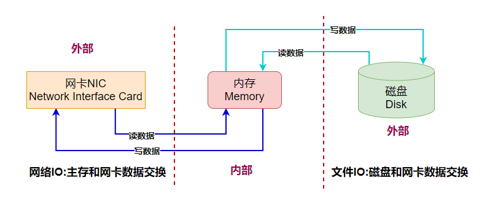

那什么又是IO事件呢？

事件可以理解为一种状态或者动作，也就是状态的迁移会触发一种相应的动作。

网络IO的事件通常包括：

- **可读事件**
- **可写事件**
- **异常事件**

理解可读可写事件是非常有必要的，一般来说一个socket大部分时候是可写的，但是并不是都可读。

可读一般代表是一个新连接或者原有连接有新数据交互，对于服务端程序来说也是重点关注的事件。

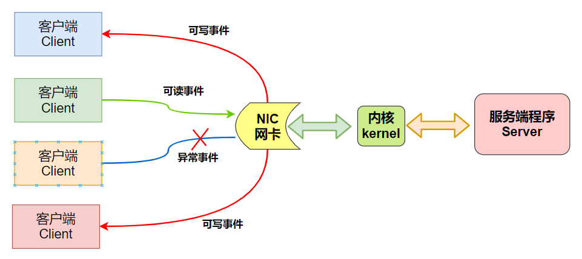

### 什么是IO复用

设想假如有几万个IO事件，那么应用程序该如何管理呢？这就要提到IO复用了。

**IO复用从本质上来说就是应用程序借助于IO复用函数向内核注册很多类型的IO事件，当这些注册的IO事件发生变化时内核就通过IO复用函数来通知应用程序。**

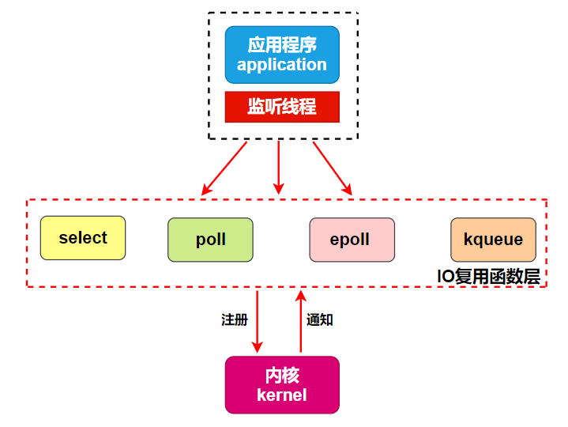

从图中可以看到，IO复用中复用的就是一个负责监听管理这些IO事件的线程。

之所以可以实现一个线程管理成百上千个IO事件，是因为大部分时间里某个时刻只有少量IO事件被触发。

大概就像这样：**草原上的一只大狗可以看管几十只绵羊，因为大部分时候只有个别绵羊不守规矩乱跑，其他的都是乖乖吃草**。

## 网络框架设计要素

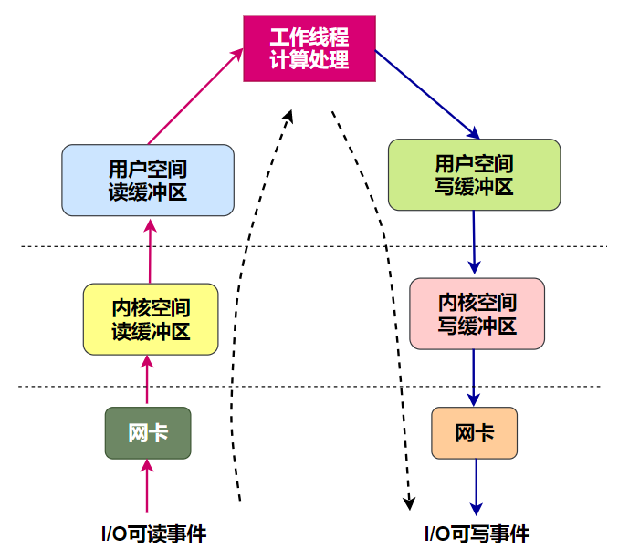

大致描述下这个请求处理的流程：

- 远端的机器A发送了一个HTTP请求到服务器B，此时服务器B网卡接收到数据并产生一个IO可读事件;
- 我们以同步IO为例，此时内核将该可读事件通知到应用程序的Listen线程;
- Listen线程将任务甩给Handler线程，由Handler将数据从内核读缓冲区拷贝到用户空间读缓冲区;
- 请求数据包在应用程序内部进行计算和处理并封装响应包;
- Handler线程等待可写事件的到来;
- 当这个连接可写时将数据从用户态写缓冲区拷贝到内核缓冲区，并通过网卡发送出去;

所以我们可以知道，要完成一个数据交互，涉及了几大块内容：

- **IO事件监听**
- **数据拷贝**
- **数据处理和计算**

小林认为，这三大块内容，不论什么形式的框架都绕不开，也是理解网络架构的关键所在。

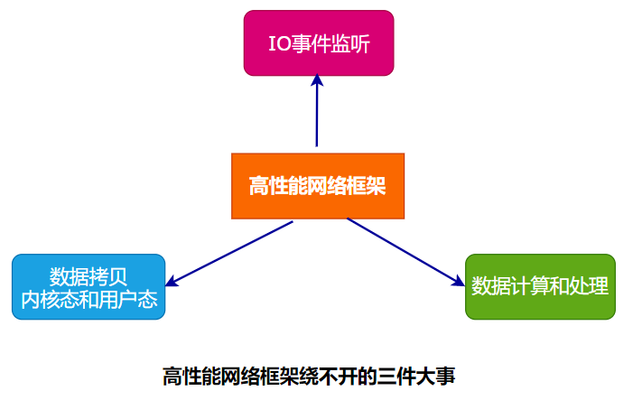

### 基于线程模型

在早期并发数不多的场景中，有一种One Request One Thread的架构模式。

该模式下每次接收一个新请求就创建一个处理线程，线程虽然消耗资源并不多，但是成千上万请求打过来，性能也是扛不住的。

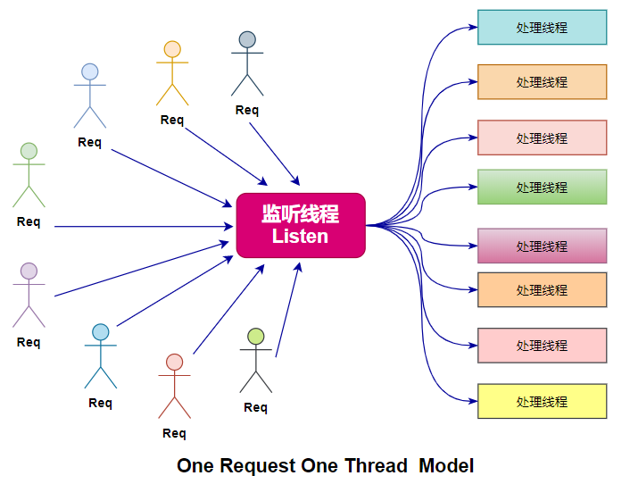

这是一种比较原始的架构，思路也非常清晰，创建多个线程来提供处理能力，但在高并发生产环境中几乎没有应用，本文不再展开。

### 基于事件驱动模型

当前流行的是基于事件驱动的IO复用模型，相比多线程模型优势很明显。

在此我们先理解一下什么是事件驱动Event-Drive-Model。

事件驱动编程是一种编程范式，程序的执行流由外部事件来决定，它的特点是包含一个事件循环，当外部事件发生时使用回调机制来触发相应的处理。

通俗来说就是：**有一个循环装置在一直等待各种事件的到来，并将到达的事件放到队列中，再由一个分拣装置来调用对应的处理装置来响应**。

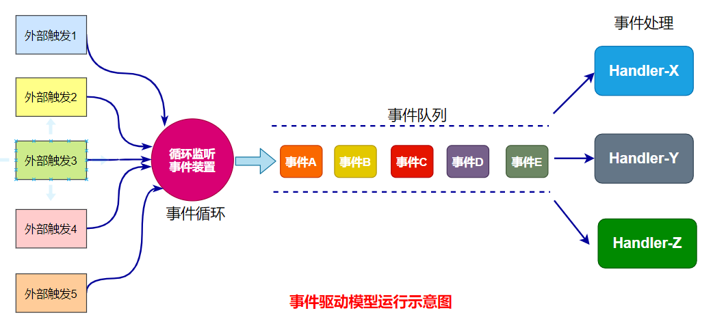

###  Reactor反应堆模式

**反应堆模式是一种思想，形式却有很多种。**

### 反应堆模式的本质是什么

从本质上理解，无论什么网络框架都要完成两部分操作：

- **IO操作**：数据包的读取和写入
- **CPU操作**：数据请求的处理和封装

所以上述这些问题**由谁来做以及多少线程来做，就衍生出了很多形式**，所以不要被表面现象迷惑，出现必有原因，追溯之后我们才能真正掌握它。

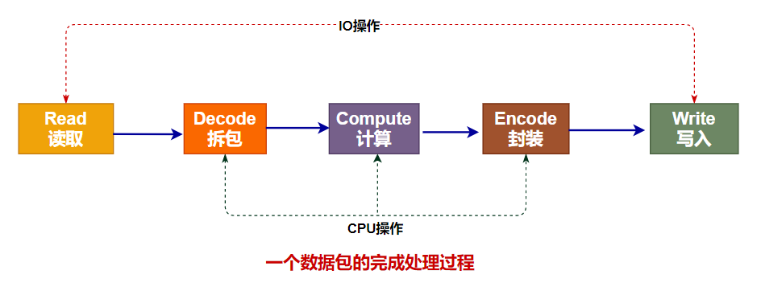

反应堆模式根据处理IO环节和处理数据环节的数量差异分为如下几种：

- **单Reactor线程**
- **单Reactor线程和线程池**
- **多Reactor线程和线程池**

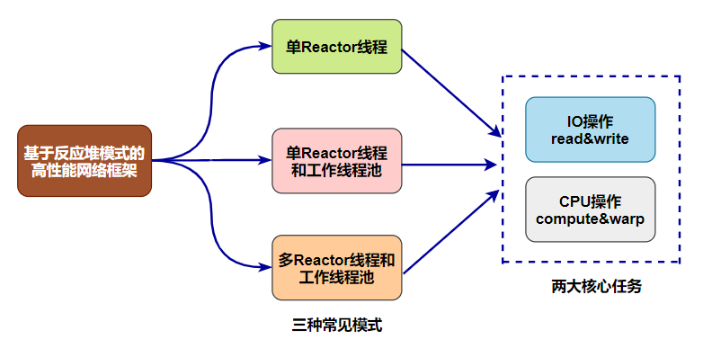

我们来看看这三种常见模式的特点、原理、优缺点、应用场景等。

### 单Reactor线程模式

这种模式最为简洁，一个线程完成了连接的监听、接收新连接、处理连接、读取数据、写入数据全套工作。

由于只使用了一个线程，对于多核利用率偏低，但是编程简单。

是不是觉得这个种单线程的模式没有市场？那可未必，不信你看Redis。

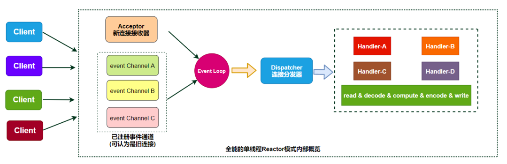

在这种模式种IO操作和CPU操作是没有分开的，都是由1个线程来完成的，显然如果在Handler处理某个请求超时了将会阻塞客户端的正常连接。

在Redis中由于都是内存操作，速度很快，这种瓶颈虽然存在但是不够明显。

### 单Reactor线程和线程池模式

为了解决IO操作和CPU操作的不匹配，也就是IO操作和CPU操作是在一个线程内部串行执行的，这样就拉低了CPU操作效率。

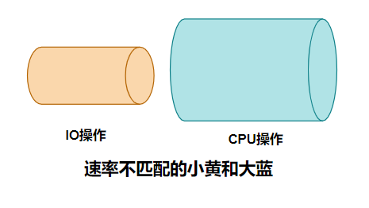

一种解决方法就是将IO操作和CPU操作分别由单独的线程来完成，各玩各的互不影响。

单Reactor线程完成IO操作、复用工作线程池来完成CPU操作就是一种解决思路。

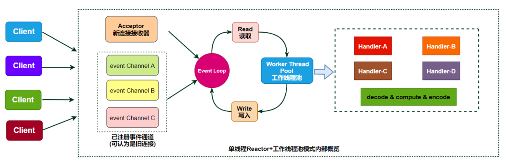

在这种模式种由Reactor线程完成连接的管理和数据读取&写回，完全掌管IO操作。

工作线程池处理来自上游分发的任务，对其中的数据进行解码、计算、编码再返回给Reactor线程和客户端完成交互。

这种模式有效利用了多核，但是单Reactor线程来完成IO操作在高并发场景中仍然会出现瓶颈。

换句话说，连接实在太多了，一个Reactor线程忙不过来建立新连接和响应旧连接这些事情，因此Reactor线程也需要几个帮手。

### 多Reactor线程和线程池模式

水平扩展往往是提供性能的有效方法。

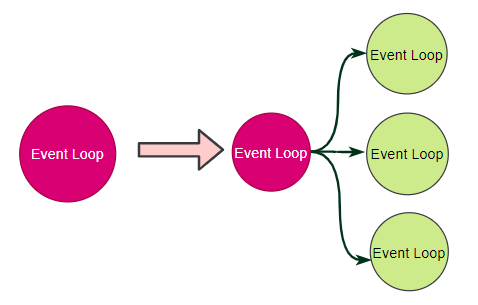

我们将Reactor线程进行扩展，一个Reactor线程负责处理新连接，多个Reactor线程负责处理连接成功的IO数据读写。

也就是进一步将监听&创建连接 和 处理连接 分别由两个及以上的线程来完成，进一步提高了IO操作部分的效率。

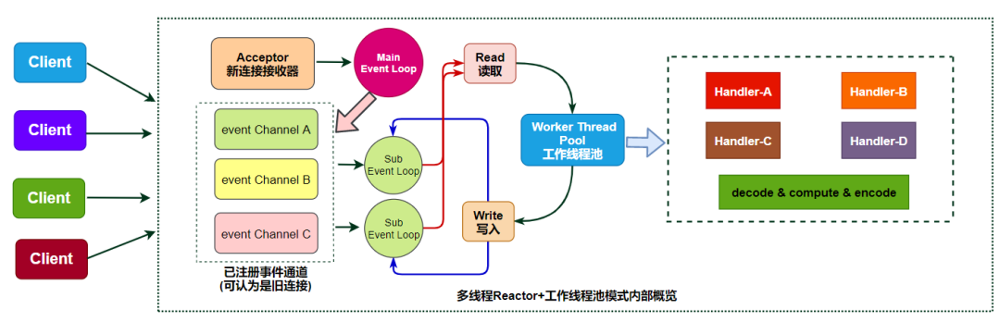

这种模式算是比较高配的版本了，在实际生产环境也有使用。

### 拓展：同步IO和异步IO

我们可以轻易区分什么是阻塞IO和非阻塞IO，那么什么是同步IO和异步IO呢？

前面提到Reactor模式其中非常重要的一环就是调用read/write函数来完成数据拷贝，这部分是应用程序自己完成的，内核只负责通知监控的事件到来了，所以本质上Reactor模式属于非阻塞同步IO。

还有一种Preactor模式，借助于系统本身的异步IO特性，由操作系统进行数据拷贝，在完成之后来通知应用程序来取就可以，效率更高一些，但是底层需要借助于内核的异步IO机制来实现。

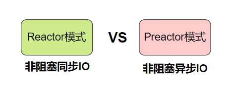

底层的异步IO机制可能借助于DMA和Zero-Copy技术来实现，理论上性能更高。

当前Windows系统通过IOCP实现了真正的异步I/O，而在Linux 系统的异步I/O还不完善，比如Linux中的boost.asio模块就是异步IO的支持，但是目前Linux系统还是以基于Reactor模式的非阻塞同步IO为主。