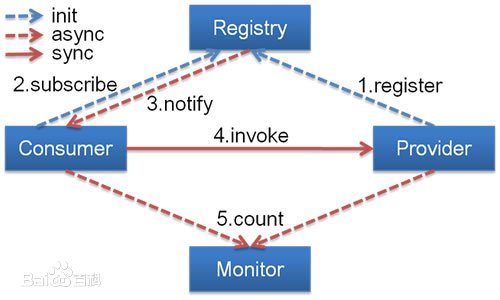
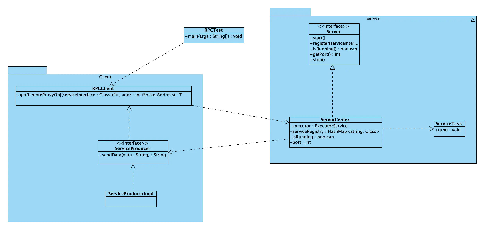
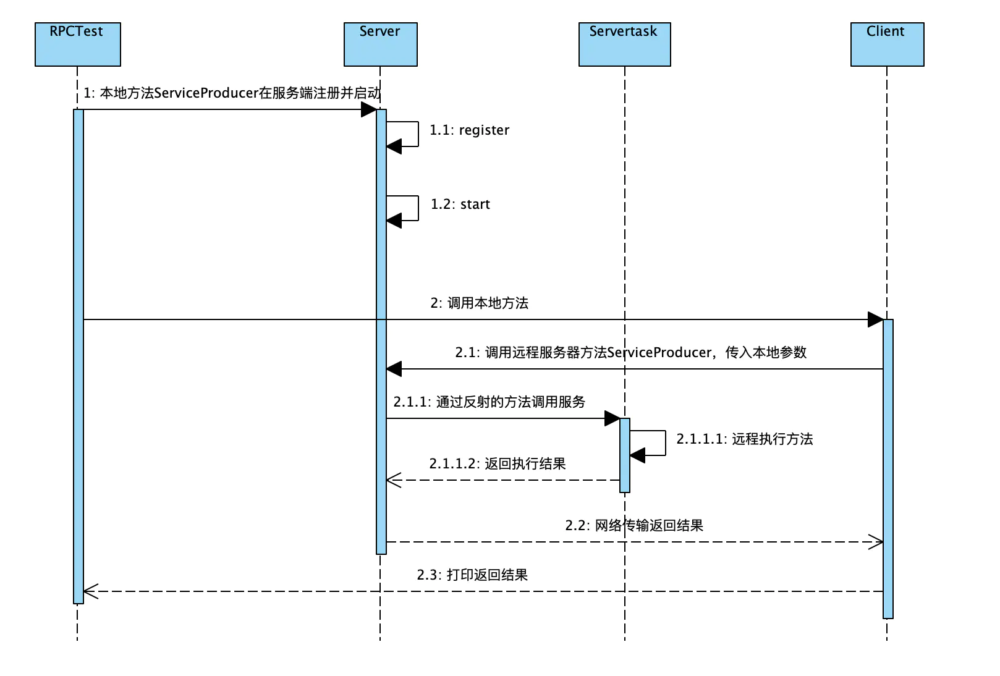

# DUBBO


#### 定义：

Dubbo(读音[ˈdʌbəʊ])是阿里巴巴公司开源的一个高性能优秀的[服务框架](https://baike.baidu.com/item/服务框架)，使得应用可通过高性能的 RPC 实现服务的输出和输入功能，可以和 [1] [Spring](https://baike.baidu.com/item/Spring)框架无缝集成。

Dubbo是一款高性能、轻量级的开源Java RPC框架，它提供了三大核心能力：面向接口的远程方法调用，智能容错和负载均衡，以及服务自动注册和发现。

#### 主要核心部件：

- **Remoting:** 网络通信框架，实现了 sync-over-async 和 request-response 消息机制
-  **RPC:** 一个[远程过程调用](https://baike.baidu.com/item/远程过程调用)的抽象，支持[负载均衡](https://baike.baidu.com/item/负载均衡)、[容灾](https://baike.baidu.com/item/容灾)和[集群](https://baike.baidu.com/item/集群)功能 
-  **Registry:** 服务目录框架用于服务的注册和服务事件发布和订阅 

  

#### 工作原理：

**Provider**

暴露服务方称之为“[服务提供者](https://baike.baidu.com/item/服务提供者/12725153)”。

**Consumer**

调用[远程服务](https://baike.baidu.com/item/远程服务)方称之为“服务消费者”。

**Registry**

服务注册与发现的中心目录服务称之为“服务注册中心”。

**Monitor**

统计服务的调用次数和调用时间的日志服务称之为“服务监控中心”。

(1) 连通性：

注册中心负责服务地址的注册与查找，相当于[目录服务](https://baike.baidu.com/item/目录服务)，[服务提供者](https://baike.baidu.com/item/服务提供者/12725153)和消费者只在启动时与注册中心交互，注册中心不转发请求，压力较小

监控中心负责统计各服务调用次数，调用时间等，统计先在内存汇总后每分钟一次发送到监控中心服务器，并以报表展示

服务提供者向注册中心注册其提供的服务，并汇报调用时间到监控中心，此时间不包含网络开销

服务消费者向注册中心获取[服务提供者](https://baike.baidu.com/item/服务提供者/12725153)地址列表，并根据负载算法直接调用提供者，同时汇报调用时间到监控中心，此时间包含网络开销

注册中心，服务提供者，服务消费者三者之间均为长连接，监控中心除外

注册中心通过[长连接](https://baike.baidu.com/item/长连接)感知服务提供者的存在，服务提供者宕机，注册中心将立即推送事件通知消费者

注册中心和监控中心全部宕机，不影响已运行的提供者和消费者，消费者在[本地缓存](https://baike.baidu.com/item/本地缓存)了提供者列表

注册中心和监控中心都是可选的，服务消费者可以直连服务提供者

(2) 健壮性：

监控中心宕掉不影响使用，只是丢失部分[采样数据](https://baike.baidu.com/item/采样数据)

数据库宕掉后，注册中心仍能通过[缓存](https://baike.baidu.com/item/缓存)提供服务列表查询，但不能注册新服务

注册中心对等[集群](https://baike.baidu.com/item/集群)，任意一台宕掉后，将自动切换到另一台

注册中心全部宕掉后，[服务提供者](https://baike.baidu.com/item/服务提供者/12725153)和服务消费者仍能通过本地缓存通讯

服务提供者无状态，任意一台宕掉后，不影响使用

服务提供者全部宕掉后，服务消费者应用将无法使用，并无限次重连等待服务提供者恢复

(3) 伸缩性：

注册中心为对等集群，可动态增加机器部署实例，所有客户端将自动发现新的注册中心

服务提供者无状态，可动态增加机器部署实例，注册中心将推送新的服务提供者信息给消费者

#### 特性：

- 面向接口代理的高性能RPC调用

  提供高性能的基于代理的远程调用能力，服务以接口为粒度，为开发者屏蔽远程调用底层细节。

- 智能负载均衡

  内置多种负载均衡策略，智能感知下游节点健康状况，显著减少调用延迟，提高系统吞吐量。

- 服务自动注册与发现

  支持多种注册中心服务，服务实例上下线实时感知。

- 高度可扩展能力

  遵循微内核+插件的设计原则，所有核心能力如Protocol、Transport、Serialization被设计为扩展点，平等对待内置实现和第三方实现。

- 运行期流量调度

  内置条件、脚本等路由策略，通过配置不同的路由规则，轻松实现灰度发布，同机房优先等功能。

- 可视化的服务治理与运维

  提供丰富服务治理、运维工具：随时查询服务元数据、服务健康状态及调用统计，实时下发路由策略、调整配置参数。

# 什么是RPC?(Remote Procedure Call 远程过程调用)


#### 基本概念：

- RPC（Remote Procedure Call）远程过程调用，简单的理解是一个节点请求另一个节点提供的服务
- 本地过程调用：如果需要将本地student对象的age+1，可以实现一个addAge()方法，将student对象传入，对年龄进行更新之后返回即可，本地方法调用的函数体通过**函数指针**来指定。
- 远程过程调用：上述操作的过程中，如果addAge()这个方法在服务端，执行函数的函数体在远程机器上，如何告诉机器需要调用这个方法呢？

1. 首先客户端需要告诉服务器，需要调用的函数，这里**函数和进程ID**存在一个**映射**，客户端远程调用时，需要查一下函数，找到对应的**ID**，然后执行函数的**代码**。

2. 客户端需要把**本地参数**传给远程函数，本地调用的过程中，**直接压栈**即可，但是在远程调用过程中**不再**同一个**内存**里，无法直接传递函数的参数，因此需要客户端把参数转换成**字节流**，传给服务端，然后服务端将字节流**转换**成自身能读取的**格式**，是一个**序列化**和**反序列化**的过程。

3.  数据准备好了之后，如何进行传输？网络传输层需要把调用的ID和序列化后的参数传给服务端，然后把计算好的结果序列化传给客户端，因此TCP层即可完成上述过程，gRPC中采用的是HTTP2协议。 

   ```java
   // Client端 
   //    Student student = Call(ServerAddr, addAge, student)
   1. 将这个调用映射为Call ID。
   2. 将Call ID，student（params）序列化，以二进制形式打包
   3. 把2中得到的数据包发送给ServerAddr，这需要使用网络传输层
   4. 等待服务器返回结果
   5. 如果服务器调用成功，那么就将结果反序列化，并赋给student，年龄更新
   
   // Server端
   1. 在本地维护一个Call ID到函数指针的映射call_id_map，可以用Map<String, Method> callIdMap
   2. 等待客户端请求
   3. 得到一个请求后，将其数据包反序列化，得到Call ID
   4. 通过在callIdMap中查找，得到相应的函数指针
   5. 将student（params）反序列化后，在本地调用addAge()函数，得到结果
   6. 将student结果序列化后通过网络返回给Client
   ```

     

 在微服务的设计中，一个服务A如果访问另一个Module下的服务B，可以采用HTTP REST传输数据，并在两个服务之间进行序列化和反序列化操作，服务B把执行结果返回过来。 

  

由于HTTP在应用层中完成，整个通信的代价较高，远程过程调用中直接基于TCP进行远程调用，数据传输在传输层TCP层完成，更适合对效率要求比较高的场景，RPC主要依赖于客户端和服务端之间建立Socket链接进行，底层实现比REST更复杂。

#### rpc demo

  

  

 客户端： 

```java
public class RPCClient<T> {
    public static <T> T getRemoteProxyObj(final Class<?> serviceInterface, final InetSocketAddress addr) {
        // 1.将本地的接口调用转换成JDK的动态代理，在动态代理中实现接口的远程调用
        return (T) Proxy.newProxyInstance(serviceInterface.getClassLoader(), new Class<?>[]{serviceInterface},
                new InvocationHandler() {
                    @Override
                    public Object invoke(Object proxy, Method method, Object[] args) throws Throwable {
                        Socket socket = null;
                        ObjectOutputStream output = null;
                        ObjectInputStream input = null;
                        try{
                            // 2.创建Socket客户端，根据指定地址连接远程服务提供者
                            socket = new Socket();
                            socket.connect(addr);

                            // 3.将远程服务调用所需的接口类、方法名、参数列表等编码后发送给服务提供者
                            output = new ObjectOutputStream(socket.getOutputStream());
                            output.writeUTF(serviceInterface.getName());
                            output.writeUTF(method.getName());
                            output.writeObject(method.getParameterTypes());
                            output.writeObject(args);

                            // 4.同步阻塞等待服务器返回应答，获取应答后返回
                            input = new ObjectInputStream(socket.getInputStream());
                            return input.readObject();
                        }finally {
                            if (socket != null){
                                socket.close();
                            }
                            if (output != null){
                                output.close();
                            }
                            if (input != null){
                                input.close();
                            }
                        }
                    }
                });
    }
}
```

 服务端： 

```java
public class ServiceCenter implements Server {

    private static ExecutorService executor = Executors.newFixedThreadPool(Runtime.getRuntime().availableProcessors());

    private static final HashMap<String, Class> serviceRegistry = new HashMap<String, Class>();

    private static boolean isRunning = false;

    private static int port;


    public ServiceCenter(int port){
        ServiceCenter.port = port;
    }


    @Override
    public void start() throws IOException {
        ServerSocket server = new ServerSocket();
        server.bind(new InetSocketAddress(port));
        System.out.println("Server Start .....");
        try{
            while(true){
                executor.execute(new ServiceTask(server.accept()));
            }
        }finally {
            server.close();
        }
    }

    @Override
    public void register(Class serviceInterface, Class impl) {
        serviceRegistry.put(serviceInterface.getName(), impl);
    }

    @Override
    public boolean isRunning() {
        return isRunning;
    }

    @Override
    public int getPort() {
        return port;
    }

    @Override
    public void stop() {
        isRunning = false;
        executor.shutdown();
    }
   private static class ServiceTask implements Runnable {
        Socket client = null;

        public ServiceTask(Socket client) {
            this.client = client;
        }

        @Override
        public void run() {
            ObjectInputStream input = null;
            ObjectOutputStream output = null;
            try{
                input = new ObjectInputStream(client.getInputStream());
                String serviceName = input.readUTF();
                String methodName = input.readUTF();
                Class<?>[] parameterTypes = (Class<?>[]) input.readObject();
                Object[] arguments = (Object[]) input.readObject();
                Class serviceClass = serviceRegistry.get(serviceName);
                if(serviceClass == null){
                    throw new ClassNotFoundException(serviceName + "not found!");
                }
                Method method = serviceClass.getMethod(methodName, parameterTypes);
                Object result = method.invoke(serviceClass.newInstance(), arguments);

                output = new ObjectOutputStream(client.getOutputStream());
                output.writeObject(result);
            }catch (Exception e){
                e.printStackTrace();
            }finally {
                if(output!=null){
                    try{
                        output.close();
                    }catch (IOException e){
                        e.printStackTrace();
                    }
                }
                if (input != null) {
                    try {
                        input.close();
                    } catch (IOException e) {
                        e.printStackTrace();
                    }
                }
                if (client != null) {
                    try {
                        client.close();
                    } catch (IOException e) {
                        e.printStackTrace();
                    }
                }
            }
        }
    }
}

```

```java
public class ServiceProducerImpl implements ServiceProducer{
    @Override
    public String sendData(String data) {
        return "I am service producer!!!, the data is "+ data;
    }
}
```

```java
public class RPCTest {
    public static void main(String[] args) throws IOException {
        new Thread(new Runnable() {
            @Override
            public void run() {
                try {
                    Server serviceServer = new ServiceCenter(8088);
                    serviceServer.register(ServiceProducer.class, ServiceProducerImpl.class);
                    serviceServer.start();
                } catch (IOException e) {
                    e.printStackTrace();
                }
            }
        }).start();
        ServiceProducer service = RPCClient.getRemoteProxyObj(ServiceProducer.class, new InetSocketAddress("localhost", 8088));
        System.out.println(service.sendData("test"));
    }
}
```

#### 分析

这里客户端只需要知道Server端的接口ServiceProducer即可，服务端在执行的时候，会根据具体实例调用实际的方法ServiceProducerImpl，符合面向对象过程中父类引用指向子类对象。

#### gRPC与REST

- REST通常以业务为导向，将业务对象上执行的操作映射到HTTP动词，格式非常简单，可以使用浏览器进行扩展和传输，通过JSON数据完成客户端和服务端之间的消息通信，直接支持请求/响应方式的通信。不需要中间的代理，简化了系统的架构，不同系统之间只需要对JSON进行解析和序列化即可完成数据的传递。
- 但是REST也存在一些弊端，比如只支持请求/响应这种单一的通信方式，对象和字符串之间的序列化操作也会影响消息传递速度，客户端需要通过服务发现的方式，知道服务实例的位置，在单个请求获取多个资源时存在着挑战，而且有时候很难将所有的动作都映射到HTTP动词。
- 正是因为REST面临一些问题，因此可以采用gRPC作为一种替代方案，gRPC 是一种基于二进制流的消息协议，可以采用基于Protocol Buffer的IDL定义grpc API,这是Google公司用于序列化结构化数据提供的一套语言中立的序列化机制，客户端和服务端使用HTTP/2以Protocol Buffer格式交换二进制消息。
- gRPC的优势是，设计复杂更新操作的API非常简单，具有高效紧凑的进程通信机制，在交换大量消息时效率高，远程过程调用和消息传递时可以采用双向的流式消息方式，同时客户端和服务端支持多种语言编写，互操作性强；不过gRPC的缺点是不方便与JavaScript集成，某些防火墙不支持该协议。
- 注册中心：当项目中有很多服务时，可以把所有的服务在启动的时候注册到一个注册中心里面，用于维护服务和服务器之间的列表，当注册中心接收到客户端请求时，去找到该服务是否远程可以调用，如果可以调用需要提供服务地址返回给客户端，客户端根据返回的地址和端口，去调用远程服务端的方法，执行完成之后将结果返回给客户端。这样在服务端加新功能的时候，客户端不需要直接感知服务端的方法，服务端将更新之后的结果在注册中心注册即可，而且当修改了服务端某些方法的时候，或者服务降级服务多机部署想实现负载均衡的时候，我们只需要更新注册中心的服务群即可。

