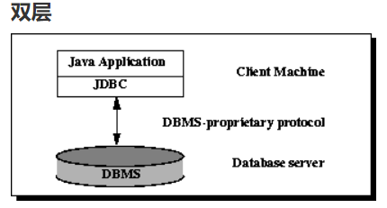
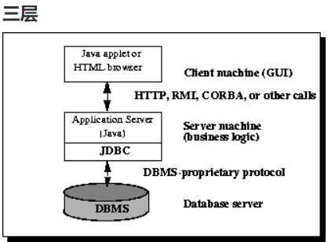
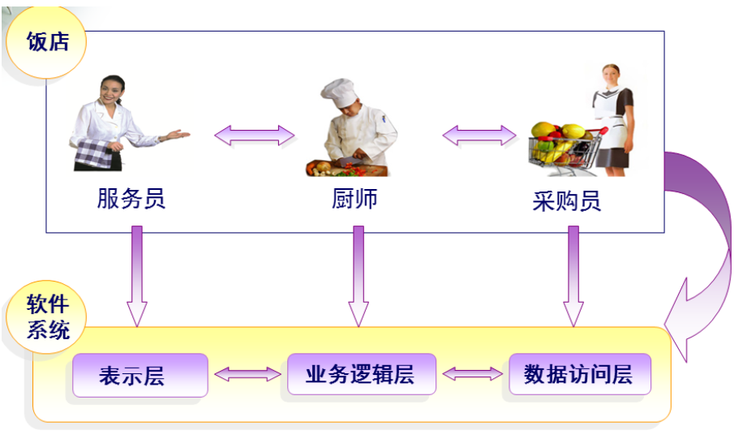

# JDBC使用说明

JDBC API 允许用户访问任何形式的表格数据，尤其是存储在关系数据库中的数据。

执行流程：

- 连接数据源，如：数据库。
- 为数据库传递查询和更新指令。
- 处理数据库响应并返回的结果。

#### JDBC 架构

分为双层架构和三层架构。

作用：此架构中，Java Applet 或应用直接访问数据源。

条件：要求 Driver 能与访问的数据库交互。

机制：用户命令传给数据库或其他数据源，随之结果被返回。

部署：数据源可以在另一台机器上，用户通过网络连接，称为 C/S配置（可以是内联网或互联网）。

此架构特殊之处在于，引入中间层服务。

流程：命令和结构都会经过该层。

吸引：可以增加企业数据的访问控制，以及多种类型的更新；另外，也可简化应用的部署，并在多数情况下有性能优势。

历史趋势： 以往，因性能问题，中间层都用 C 或 C++ 编写，随着优化编译器（将 Java 字节码 转为 高效的 特定机器码）和技术的发展，如EJB，Java 开始用于中间层的开发这也让 Java 的优势突显出现出来，使用 Java 作为服务器代码语言，JDBC随之被重视。

