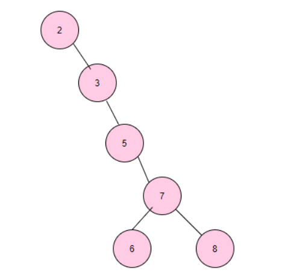
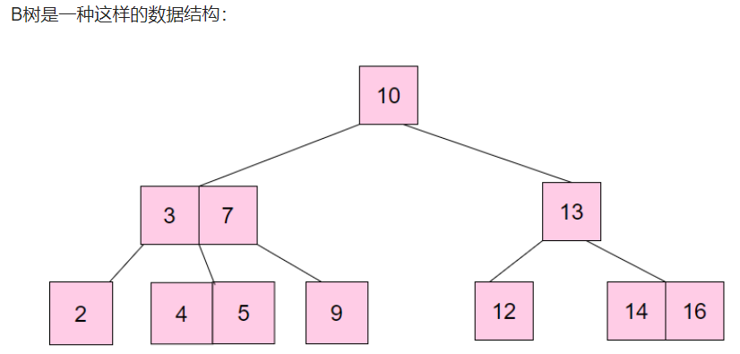
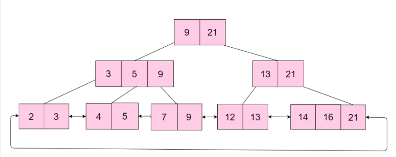

# 为什么 B+ 树比 B 树更适合应用于数据库索引？

你可能已经知道B+树被用于Mysql的索引底层实现，那么，为什么是B+树呢？本文由浅及深，带你探索数据库索引底层实现。

#### 由一个例子总结索引的特点

加索引是数据库加速查询的一种方式，那么为什么用索引可以加快查询呢？

讲到索引，其实我们经常会听到一个图书馆的例子，图书馆里的书目繁杂，我们如何从若干本书里面找到一本我们想要的书呢？

我们根据图书馆系统检索，可以找到某本书对应的图书编号。

在基于书籍按照一定规则排列的前提下，我们可以根据图书编号找到这本书。

例如，假设图书编号根据：

第几个书架 - 书架上第几个格子 - 从左到右数第几个位置

这样的规则编排，

我们就可以轻松的获取到我们想要的书籍。

你也许发现了，这个例子中，藏着两个信息：

按照一定的规则排列

有序

按照一定的规则，建立一定的映射关系，这让你联想到了什么？

没错，就是哈希表。

#### 基于哈希表实现的哈希索引

在Mysql的InnoDB引擎中，自适应哈希索引就是用哈希表实现的。

哈希索引是数据库自身创建并使用的，DBA本身不能对其进行干预，但是可以通过参数来禁止或者启用此特性。

显然用哈希表实现索引的好处是非常明显的，查找单个指定数据只需要O(1)的时间复杂度。

*说明：因为哈希表本身是无序的，所以不利于范围查询*

**再次思考**
到这里我们遇到了一个问题，就是哈希表虽然从查找效率上满足了我们查找单个数据的要求，但是显然，当遇到范围查询时，由于哈希表本身的无序性，不利于指定范围查找。

也就是说，我们的需求增加了，我们希望数据的组织方式，既要有一定规则，又要有序。

在引出这种数据结构之前，我们首先来看一种查找方式：二分查找。

#### 高效的查找方式：二分查找

二分查找的核心思想是给定一个有序的数组，在查找过程中采用跳跃式的方式查找，即先以有序数列的中点位置为比较对象，如果要查找的元素小于中点元素，则将待查序列缩小为左半部分，否则为右半部分。通过每次比较，将查找区间减少一半，直到找到所需元素。

比如要从以下序列中查找到数字4

需要经过下面的查找步骤：

取中心位置对应元素，显然5大于4，在左边区间[1,3,4]进行查找

继续取中心位置对应元素3，显然3大于4,在右边区间[4]进行查找

4等于4，所以我们查找成功。

可以看到二分查找的效率是O(log n)。

由于有序数组自身的有序性，所以范围查询依然可以通过二分查找的方式查找区间的边界来实现。

这样看来，如果单从查询效率上来说，有序的数组是一种很好的选择。

但是显然有序数组对于插入和删除并不友好，假设我们要插入元素或者删除元素，都需要把部分元素全部向后或者向前移动，最糟糕的时间复杂度是O(n)。

有没有这样一种数据结构，既有一定顺序，又方便插入和删除呢？事实上，基于二分查找的思想，诞生了这样一种数据结构：二分查找树。

#### 基于二分查找思想的二叉查找树

二叉查找树（Binary Search Tree）即BST树是这样的一种数据结构,如下图：

在二叉搜索树中：

1).若任意结点的左子树不空，则左子树上所有结点的值均不大于它的根结点的值。

2).若任意结点的右子树不空，则右子树上所有结点的值均不小于它的根结点的值。

3).任意结点的左、右子树也分别为二叉搜索树。

这样的结构非常适合用二分查找的思维查找元素。

比如我们需要查找键值为8的记录：

1. 先从根找起，找到6；
2. 显然8>6，所以接着找到6的右子树，找到7；
3. 显然8>7, 所以找7的右子树，找到了8，查找结束。

这样一棵子树高度差不大于1的二叉查找树的查找效率接近与O(log n);

但是当二叉树的构造变成这样时,

此时我们再查找8时,查找效率就沦为接近顺序遍历查找的效率。

显然这不是我们想要的，二叉查找树也需要balance。

升级版的BST树：平衡二叉树
我们对二叉查找树做个限制，限制必须满足任何节点的两个子树的最大差为1，也是平衡二叉树的定义，这样我们的查找效率就有了一定的保障。

平衡二叉树(self-balancing binary search tree),又叫AVL树。

当然，维护平衡二叉树也是需要一定开销的，即当树插入/更新/删除新的数据时假设破坏了树的平衡性，那么需要通过左旋和右旋来维护树的平衡。

当数据量很多时，同样也会出现二叉树过高的情况。

我们知道平衡二叉树的查找效率为 O(log n)，也就是说，当树过高时，查找效率会下降。

另外由于我们的索引文件并不小，所以是存储在磁盘上的。

文件系统需要从磁盘读取数据时，一般以页为单位进行读取，假设一个页内的数据过少，
那么操作系统就需要读取更多的页，涉及磁盘随机I/O访问的次数就更多。

将数据从磁盘读入内存涉及随机I/O的访问，是数据库里面成本最高的操作之一。

因而这种树高会随数据量增多急剧增加，每次更新数据又需要通过左旋和右旋维护平衡的二叉树，不太适合用于存储在磁盘上的索引文件。

#### 更加符合磁盘特征的B树

前面我们看到，虽然平衡二叉树既有链表的快速插入与删除操作的特点，又有数组快速查找的优势，但是这并不是最符合磁盘读写特征的数据结构。

也就是说，我们要找到这样一种数据结构，能够有效的控制树高，那么我们把二叉树变成m叉树，也就是下图的这种数据结构:B树。

1.根结点至少有两个子结点;

2.每个中间节点都包含k-1个元素和k个子结点，其中 m/2 <= k <= m;

3.每一个叶子结点都包含k-1个元素，其中 m/2 <= k <= m;

4.所有的叶子结点都位于同一层;

5.每个结点中关键字从小到大排列，并且当该结点的孩子是非叶子结点时，该k-1个元素正好是k个子结点包含的元素的值域的分划。

可以看到，B树在保留二叉树预划分范围从而提升查询效率的思想的前提下，做了以下优化：

二叉树变成m叉树，这个m的大小可以根据单个页的大小做对应调整，从而使得一个页可以存储更多的数据，从磁盘中读取一个页可以读到的数据就更多，随机IO次数变少，大大提升效率。

但是我们看到，我们只能通过中序遍历查询全表，当进行范围查询时，可能会需要中序回溯。

#### 不断优化的B树：B+树

基于以上的缺陷，又诞生了一种新的优化B树的树:B+树

B+树在B树的基础上加了以下优化：

1.叶子结点增加了指针进行连接，即叶子结点间形成了链表；

2.非叶子结点只存关键字key，不再存储数据，只在叶子结点存储数据；

说明：叶子之间用双向链表连接比单向链表连接多出的好处是通过链表中任一结点都可以通过往前或者往后遍历找到链表中指定的其他结点。

这样做的好处是：

1.范围查询时可以通过访问叶子节点的链表进行有序遍历，而不再需要中序回溯访问结点。

2.非叶子结点只存储关键字key，一方面这种结构相当于划分出了更多的范围，加快了查询速度，另一方面相当于单个索引值大小变小，同一个页可以存储更多的关键字，读取单个页就可以得到更多的关键字，可检索的范围变大了，相对IO读写次数就降低了。

一些总结
B+ 树和 B 树的区别？
1.B树非叶子结点和叶子结点都存储数据,因此查询数据时，时间复杂度最好为O(1),最坏为O(log n)。

B+树只在叶子结点存储数据，非叶子结点存储关键字，且不同非叶子结点的关键字可能重复，因此查询数据时，时间复杂度固定为O(log n)。

2.B+树叶子结点之间用链表相互连接，因而只需扫描叶子结点的链表就可以完成一次遍历操作，B树只能通过中序遍历。

为什么 B+ 树比 B 树更适合应用于数据库索引？
B+树更加适应磁盘的特性，相比B树减少了I/O读写的次数。由于索引文件很大因此索引文件存储在磁盘上，B+树的非叶子结点只存关键字不存数据，因而单个页可以存储更多的关键字，即一次性读入内存的需要查找的关键字也就越多，磁盘的随机I/O读取次数相对就减少了。

B+树的查询效率相比B树更加稳定，由于数据只存在在叶子结点上，所以查找效率固定为O(log n)。

B+树叶子结点之间用链表有序连接，所以扫描全部数据只需扫描一遍叶子结点，利于扫库和范围查询；B树由于非叶子结点也存数据，所以只能通过中序遍历按序来扫。也就是说，对于范围查询和有序遍历而言，B+树的效率更高。

