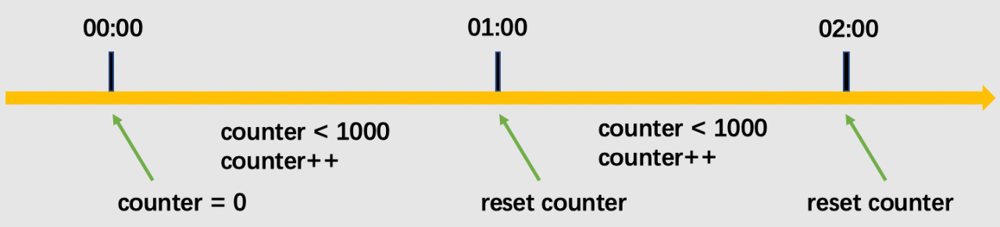
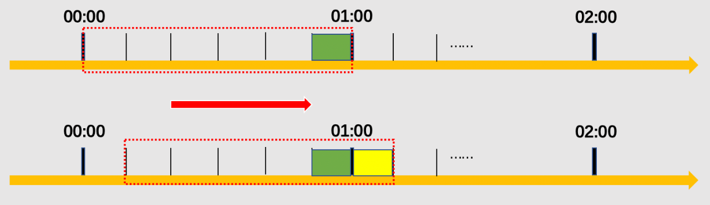
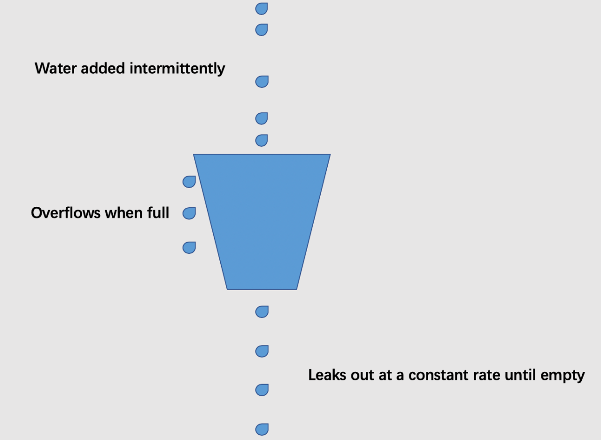
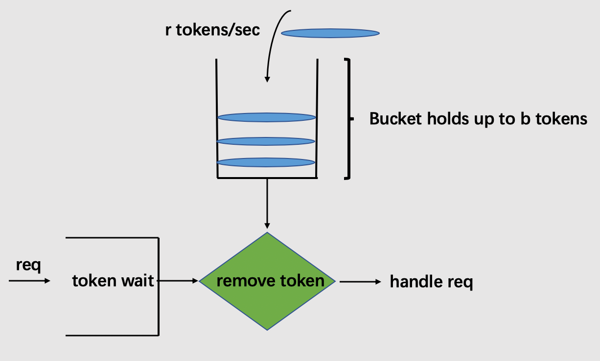

# 高并发系统之限流技术

在开发高并发系统时，有三把利器用来保护系统：缓存、降级和限流。限流是指通过对并发访问/请求进行限速或者对一个时间内的的请求进行限量来保护系统，一旦达到限制条件则可以拒绝服务。


总体来说，实现限流有三种主流方式：**计数器，漏桶算法（leaky-bucket）和令牌桶算法**（token-bucket）。

## **计数器**

**1. 简单计数器**

简单计数器是限流算法中最简单也是最容易实现的一种算法。比如我们规定，对于接口A来说，1分钟的请求次数不能超过1000次。那么，设置一个请求计数器，将初始值设为0。当有请求进来时，会把计数器+1，如果在1分钟间隔以内计数器的值大于1000，说明请求数过多，对后续请求拒绝服务；当1分钟间隔后，重置计数器


限流器定义

```go

type RequestLimitService struct {
  Interval time.Duration  // 设置时间窗口大小
  MaxCount int            // 窗口内能支持的最大请求数（阈值）
  Lock     sync.Mutex     // 并发控制锁
  ReqCount int            // 当前窗口请求数（计数器）
}
```

实现限流器的两个核心方法

```go
// 判断当前窗口请求数是否大于最大请求数
func (reqLimit *RequestLimitService) IsAvailable() bool {
  reqLimit.Lock.Lock()
  defer reqLimit.Lock.Unlock()

  return reqLimit.ReqCount < reqLimit.MaxCount
}

// 对当前窗口请求数 +1
func (reqLimit *RequestLimitService) Increase() {
  reqLimit.Lock.Lock()
  defer reqLimit.Lock.Unlock()

  reqLimit.ReqCount += 1
}
```

生成限流器

```go

func NewRequestLimitService(interval time.Duration, maxCnt int) *RequestLimitService {
  reqLimit := &RequestLimitService{
    Interval: interval,
    MaxCount: maxCnt,
  }

  go func() {
    ticker := time.NewTicker(interval) // 当达到窗口时间，将计数器清零
    for {
      <-ticker.C
      reqLimit.Lock.Lock()
      fmt.Println("Reset Count...")
      reqLimit.ReqCount = 0
      reqLimit.Lock.Unlock()
    }
  }()

  return reqLimit
}
```

简单计数器算法实现起来非常方便，但是简单说明了它能考虑到的问题不够全面。设想，在上面的例子中，如果某用户在00：59到01：00之间发送了500个请求，并且在01：00和01：01之间又发送了500个请求，那么用户其实在这2秒间就已经发送了1000个请求，他的请求应该被拒绝。但是，简单计数器的设计则允许了这样的情况发生。因此，如果恶意用户利用通过在临近时间窗口的重置计数机制而发起大量突发请求，那么我们的系统很容易就被弄瘫痪。

**2. 滑动窗口**

对于刚才的问题，存在的问题就在于统计的精度太低，因此引入了滑动窗口（rolling window）的概念。



在上图中，整个红色的虚线矩形框表示一个时间窗口，该例中，一个时间窗口就是一分钟。将时间窗口进行划分，划成6格，所以每格代表的是10秒钟。每过10秒钟，窗口就会往右滑动一格。每一个格子都有自己独立的计数器counter，比如当一个请求在0:35秒的时候到达，0:30~0:39对应的counter就会加1。

那么滑动窗口怎么解决刚才的临界问题的？我们可以根据上图延用刚才的例子，0:59至01:00到达的500个请求会落在绿色的格子中，而01:00至01:01到达的请求会落在黄色的格子中。当时间到达1:00时，我们的窗口会往右移动一格，那么此时时间窗口内的总请求数量一共是1000个（假定前面的格子没有发生请求），达到了限定1000的条件，所以此时能够检测出来触发了限流。

## **漏桶算法**

漏桶算法的思想比较好理解。首先，我们有一个固定容量的桶，有水流进来，也有水流出去。我们无法预计一共有多少水会流进来，也无法预计水流入的速度。但是这个桶可以固定水流出的速度。而且，当桶满了之后，多余的水将会溢出。



我们将算法中的水换成实际应用中的请求，可以看到漏桶算法天生就限制了请求的速度。当使用了漏桶算法，我们可以保证接口会以一个常速速率来处理请求。所以漏桶算法不会出现上述的临界问题。

```go

// 定义漏桶结构
type leakyBucket struct {
  timestamp time.Time // 当前注水时间戳 （当前请求时间戳）
  capacity float64    // 桶的容量（接受缓存的请求总量）
  rate  float64       // 水流出的速度（处理请求速度）
  water float64       // 当前水量（当前累计请求数）
}

// 判断是否加水（是否处理请求）
func addWater(bucket leakyBucket) bool {
  now := time.Now()
  // 先执行漏水，计算剩余水量
  leftWater := math.Max(0,bucket.water - now.Sub(bucket.timestamp).Seconds()*bucket.rate)
  bucket.timestamp = now
  if leftWater + 1 < bucket.water {
    // 尝试加水，此时水桶未满
    bucket.water = leftWater +1
    return true
  }else {
    // 水满了，拒绝加水
    return false
  }
}
```

### **令牌桶算法**

对于很多应用场景来说，除了要求能够限制数据的平均传输速率外，还要求允许某种程度的突发传输。这时候漏桶算法就不合适了，令牌桶算法派上了用场。



从图中我们可以看到，令牌桶算法比漏桶算法稍显复杂。首先，我们有一个固定容量的桶，桶里存放着令牌（token）。桶一开始是空的，token以一个固定的速率r往桶里填充，直到达到桶的容量，多余的令牌将会被丢弃。每当一个请求过来时，就会尝试从桶里移除一个令牌，如果没有令牌的话，请求无法通过。

```go

// 定义令牌桶结构
type tokenBucket struct {
  timestamp time.Time // 当前时间戳
  capacity float64  // 桶的容量（存放令牌的最大量）
  rate  float64// 令牌放入速度
  tokens float64 // 当前令牌总量
}

// 判断是否获取令牌（若能获取，则处理请求）
func getToken(bucket tokenBucket) bool {
  now := time.Now()
  // 先添加令牌
  leftTokens := math.Max(bucket.capacity, bucket.tokens + now.Sub(bucket.timestamp).Seconds()*bucket.rate)
  bucket.timestamp = now
  if leftTokens < 1 {
    // 若桶中一个令牌都没有了，则拒绝
    return false
  }else {
    // 桶中还有令牌，领取令牌
    bucket.tokens -= 1
    return true
  }
}
```

**令牌桶和漏桶算法对比**

- 令牌桶是按照固定速率往桶中添加令牌，请求是否被处理需要看桶中令牌是否足够，当令牌数减为零时则拒绝新的请求；
- 漏桶则是按照常量固定速率流出请求，流入请求速率任意，当流入的请求数累积到漏桶容量时，则新流入的请求被拒绝；
- 令牌桶限制的是平均流入速率（允许突发请求，只要有令牌就可以处理，支持一次拿多个令牌），并允许一定程度的突发流量；
- 漏桶限制的是常量流出速率（即流出速率是一个固定常量值，比如都是1的速率流出，而不能一次是1，下次又是2），从而平滑突发流入速率；
- 令牌桶允许一定程度的突发，而漏桶主要目的是平滑流入速率；
- 两个算法实现可以一样，但是方向是相反的，对于相同的参数得到的限流效果是一样的。

总结，漏桶算法和令牌桶算法的主要区别在于，“漏桶算法”能够强行限制数据的传输速率（或请求频率），而“令牌桶算法”在能够限制数据的平均传输速率外，还允许某种程度的突发传输。