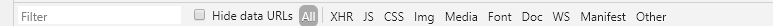

# F12抓包

  

1. ELements：元素面板。
2. Console：控制台面板
3. Sources：源代码面板
4. Network：网络面板
5. Performance：性能面板
6. Memory：内存面板
7. Application：应用面板
8. Security：安全面板
9. Audits：审核面板

#### 含义

1. **控制台（Console）**：控制台一般用于执行一次性代码，查看JavaScript对象，查看调试日志信息或异常信息。还可以当作Javascript API查看用。例如我想查看console都有哪些方法和属性，我可以直接在Console中输入"console"并执行~
2. **源代码（Sources）**：该页面用于查看页面的HTML文件源代码、JavaScript源代码、CSS源代码，此外最重要的是可以调试JavaScript源代码，可以给JS代码添加断点等。
3.  **ELements（元素面板）**： 用于查看或修改HTML元素的属性、CSS属性、监听事件、断点等。css可以即时修改，即时显示。
   -  进行元素定位：
     - 点击左上角的箭头图标（或按快捷键Ctrl+Shift+C）进入选择元素模式
     - 选择了页面需要查看的元素之后，可以在右侧查看元素的属性源代码

  

 当然从源代码中读到的只是一部分显式声明的属性，要查看该元素的所有属性，可以在右边的侧栏中查看 

   		4.**Network（网络面板）：** 网络页面主要用于查看header等与网络连接相关的信息，记录页面上每个网络操作的相关信息，包括详细的耗时数据、HTTP 请求与响应标头和 Cookie 

 		**（1）Controls：**
		使用这些选项可以控制 Network 面板的外观和功能 

  

**（2）Filters（过滤器）：** 

 使用这些选项可以控制在请求列表中显示哪些资源。 

  

筛选框的使用，可以实现很多定制化的筛选，比如字符串匹配，关键词筛选等，其中关键词筛选主要有如下几种：

- `domain`：仅显示来自指定域的资源。您可以使用通配符（）来包括多个域。例如，.com显示以.com结尾的所有域名中的资源。 DevTools会在自动完成下拉菜单中自动填充它遇到的所有域。
- `has-response-header`：显示包含指定HTTP响应头信息的资源。 DevTools会在自动完成下拉菜单中自动填充它遇到的所有响应头。
- `is`：通过is:running找出WebSocket请求。
- `larger-than(大于)` ：显示大于指定大小的资源（以字节为单位）。设置值1000等效于设置值1k。
- `method(方法)` ：显示通过指定的HTTP方法类型检索的资源。DevTools使用它遇到的所有HTTP方法填充下拉列表。
- `mime-type（mime类型）`：显示指定MIME类型的资源。 DevTools使用它遇到的所有MIME类型填充下拉列表。
- `mixed-content（混合内容）`：显示所有混合内容资源（mixed-content:all）或仅显示当前显示的内容（mixed-content:displayed）。
- `Scheme（协议）`：显示通过不受保护的HTTP（scheme:http）或受保护的HTTPS（scheme:https）检索的资源。
- `set-cookie-domain（cookie域）`：显示具有Set-Cookie头,并且其Domain属性与指定值匹配的资源。DevTools会在自动完成下拉菜单中自动填充它遇到的所有Cookie域。
- `set-cookie-name（cookie名）`：显示具有Set-Cookie头,并且名称与指定值匹配的资源。DevTools会在自动完成下拉菜单中自动填充它遇到的所有Cookie名。
- `set-cookie-value（cookie值）`：显示具有Set-Cookie头,并且值与指定值匹配的资源。DevTools会在自动完成下拉菜单中自动填充它遇到的所有cookie值。
- `status-code（状态码）`：仅显示其HTTP状态代码与指定代码匹配的资源。DevTools会在自动完成下拉菜单中自动填充它遇到的所有状态码。

 **（3）Overview（概览）** 

 这个图表显示检索资源的时间轴 

  

 **（4）Requests Table（请求列表）** 

可查看的标签会因为选择的资源类型不同而不同，一般有这4个：

- Headers：与资源关联的 HTTP 标头。

- Preview：JSON、图像和文本资源的预览。

- Response：HTTP 响应数据（如果存在）。

- Timing：资源请求生命周期的精细分解

  **Headers（查看 HTTP 标头）**
  点击 Headers 可以显示该资源的标头。Headers 标签可以显示资源的请求网址、HTTP 方法以及响应状态代码。 此外，该标签还会列出 HTTP 响应和请求标头、它们的值以及任何查询字符串参数 

   

 点击每一部分旁边的 view source 或 view parsed 链接，能够以源格式或者解析格式查看响应标头、请求标头或者查询字符串参数。 

  

 **Preview（预览资源）** 

 点击 Preview 标签可以查看该资源的预览。Preview 标签可能显示一些有用的信息，也可能不显示，具体取决于所选择资源的类型。 

  

 **Response（查看 HTTP 响应内容）**
点击 Response 标签可以查看资源未格式化的 HTTP 响应内容。 Preview 标签可能包含一些有用的信息，也可能不包含，具体取决于所选择资源的类型。 

  

 **查看 Cookie** 

 点击 Cookies 标签可以查看在资源的 HTTP 请求和响应标头中传输的 Cookie 表。 只有传输 Cookie 时，此标签才可用。 

  

- Name：Cookie 的名称。
- Value：Cookie 的值。
- Domain：Cookie 所属的域。
- Path：Cookie 来源的网址路径。
- Expires / Max-Age：Cookie 的 expires 或 max-age 属性的值。
- Size：Cookie 的大小（以字节为单位）。
- HTTP：指示 Cookie 应仅由浏览器在 HTTP 请求中设置，而无法通过 JavaScript 访问。
- Secure：如果存在此属性，则指示 Cookie 应仅通过安全连接传输。