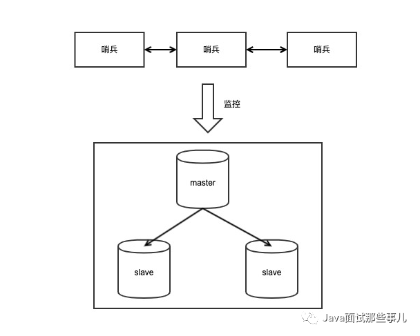

## 宕机后，Redis如何实现快速恢复？

下面就来具体来看看Redis的故障恢复是如何做的，以及其中的原理。

Redis在部署时，可以采用多种方式部署，每种部署方式对应不同的可用级别。

**单节点部署**：只有一个节点提供服务，读写均在此节点，此节点宕机则数据全部丢失，直接影响业务。

**master-slave方式部署**：两个节点组成master-slave模式，在master上写入，slave上读取，读写分离提高访问性能，master宕机后，需要手动把slave提升为master，业务影响程度取决于手动提升master的延迟。

**master-slave+哨兵方式部署**：master-slave与上述相同，不同的是增加一组哨兵节点，用于实时检查master的健康状态，在master宕机后自动提升slave为新的master，最大程度降低不可用的时间，对业务影响时间较短。

从上面几种部署模式可以看出，提高Redis可用性的关键是：**多副本部署 + 自动故障恢复**，而多副本正是依赖主从复制。

**高可用做法**

Redis原生提供master-slave数据复制，保证slave永远与master数据保持一致。

在master发生问题时，我们需要把slave提升为master，继续提供服务。而这个提升新master的操作，如果是人工处理，必然无法保证及时性，所以Redis提供了哨兵节点，用来管理master-slave节点，并在master发生问题时，能够自动进行故障恢复操作。

整个故障恢复的工作，正是Redis哨兵自动完成的。

**哨兵介绍**

哨兵是Redis高可用的解决方案，它是一个管理多个Redis实例的服务工具，可以实现对Redis实例的监控、通知、自动故障转移。

在部署哨兵时，我们只需要在配置文件中配置需要管理的master节点，哨兵节点就可以根据配置，对Redis节点进行管理，实现高可用。

一般我们需要部署多个哨兵节点，这是因为在分布式场景下，要想确定某个机器的某个节点上否发生故障，只用一台机器去检测可能是不准确的，很有可能这两台机器的网络发生了故障，而节点本身并没有问题。

所以对于节点健康检测的场景，一般都会采用多个节点同时去检测，且多个节点分布在不同机器上，节点数量为奇数个，避免因为网络分区导致哨兵决策错误。这样多个哨兵节点互相交换检测信息，最终决策才能确认某个节点上否真正发生了问题。

哨兵节点部署并配置完成后，哨兵就会自动地对配置的master-slave进行管理，在master发生故障时，及时地提升slave为新的master，保证可用性。

**那么它的工作原理上怎样的呢？**

哨兵的工作流程主要分为以下几个阶段：

- 状态感知
- 心跳检测
- 选举哨兵领导者
- 选择新的master
- 故障恢复
- 客户端感知新master

**状态感知**

哨兵启动后只指定了master的地址，哨兵要想在master故障时进行故障恢复，就需要知道每个master对应的slave信息。每个master可能不止一个slave，因此哨兵需要知道整个集群中完整的的拓扑关系，如何拿到这些信息？

哨兵每隔10秒会向每个master节点发送info命令，info命令返回的信息中，包含了主从拓扑关系，其中包括每个slave的地址和端口号。有了这些信息后，哨兵就会记住这些节点的拓扑信息，在后续发生故障时，选择合适的slave节点进行故障恢复。

哨兵除了向master发送info之外，还会向每个master节点特殊的pubsub中发送master当前的状态信息和哨兵自身的信息，其他哨兵节点通过订阅这个pubsub，就可以拿到每个哨兵发来的信息。

这么做的目的主要有2个：

- 哨兵节点可以发现其他哨兵的加入，进而方便多个哨兵节点通信，为后续共同协商提供基础
- 与其他哨兵节点交换master的状态信息，为后续判断master是否故障提供依据

**心跳检测**

在故障发生时，需要立即启动故障恢复机制，那么如何保证及时性呢？

每个哨兵节点每隔1秒向master、slave、其他哨兵节点发送ping命令，如果对方能在指定时间内响应，说明节点健康存活。如果未在规定时间内（可配置）响应，那么该哨兵节点认为此节点主观下线。

为什么叫做主观下线？

因为当前哨兵节点探测对方没有得到响应，很有可能这两个机器之间的网络发生了故障，而master节点本身没有任何问题，此时就认为master故障是不正确的。

要想确认master节点是否真正发生故障，就需要多个哨兵节点共同确认才行。

每个哨兵节点通过向其他哨兵节点询问此master的状态，来共同确认此节点上否真正故障。

如果超过指定数量（可配置）的哨兵节点都认为此节点主观下线，那么才会把这个节点标记为**客观下线**。

**选举哨兵领导者**

确认这个节点真正故障后，就需要进入到故障恢复阶段。如何进行故障恢复，也需要经历一系列流程。

首先需要选举出一个哨兵领导者，由这个专门的哨兵领导者来进行故障恢复操作，不用多个哨兵都参与故障恢复。选举哨兵领导者的过程，需要多个哨兵节点共同协商来选出。

这个选举协商的过程，在分布式领域中叫做达成共识，协商的算法叫做共识算法。

共识算法主要为了解决在分布式场景下，多个节点如何针对某一个场景达成一致的结果。

哨兵选举领导者的过程类似于Raft算法，它的算法足够简单易理解。

- 每个哨兵都设置一个**随机超时时间**，超时后向其他哨兵发送申请成为领导者的请求
- 其他哨兵只能对收到的**第一个请求**进行回复确认
- 首先达到**多数确认选票**的哨兵节点，成为领导者
- 如果在确认回复后，所有哨兵都**无法达到多数选票**的结果，那么进行**重新选举**，直到选出领导者为止

选择出哨兵领导者后，之后的故障恢复操作都由这个哨兵领导者进行操作。

**选择新的master**

哨兵领导者针对发生故障的master节点，需要在它的slave节点中，选择一个节点来代替其工作。

这个选择新master过程也是有优先级的，在多个slave的场景下，优先级按照：slave-priority配置 > 数据完整性 > runid较小者进行选择。

也就是说优先选择slave-priority最小值的slave节点，如果所有slave此配置相同，那么选择数据最完整的slave节点，如果数据也一样，最后选择runid较小的slave节点。

**提升新的master**

经过优先级选择，选出了备选的master节点后，下一步就是要进行真正的主从切换了。

哨兵领导者给备选的master节点发送slaveof no one命令，让该节点成为master。

之后，哨兵领导者会给故障节点的所有slave发送slaveof $newmaster命令，让这些slave成为新master的从节点，开始从新的master上同步数据。

最后哨兵领导者把故障节点降级为slave，并写入到自己的配置文件中，待这个故障节点恢复后，则自动成为新master节点的slave。

至此，整个故障切换完成。

**客户端感知新master**

最后，客户端如何拿到最新的master地址呢？

哨兵在故障切换完成之后，会向自身节点的指定pubsub中写入一条信息，客户端可以订阅这个pubsub来感知master的变化通知。我们的客户端也可以通过在哨兵节点主动查询当前最新的master，来拿到最新的master地址。

另外，哨兵还提供了“钩子”机制，我们也可以在哨兵配置文件中配置一些脚本逻辑，在故障切换完成时，触发“钩子”逻辑，通知客户端发生了切换，让客户端重新在哨兵上获取最新的master地址。

一般来说，推荐采用第一种方式进行处理，很多客户端SDK中已经集成好了从哨兵节点获取最新master的方法，我们直接使用即可。

可见，为了保证Redis的高可用，哨兵节点要准确无误地判断故障的发生，并且快速的选出新的节点来代替其提供服务，这中间的流程还是比较复杂的。

中间涉及到了分布式共识、分布式协商等知识，目的都是为了保证故障切换的准确性。