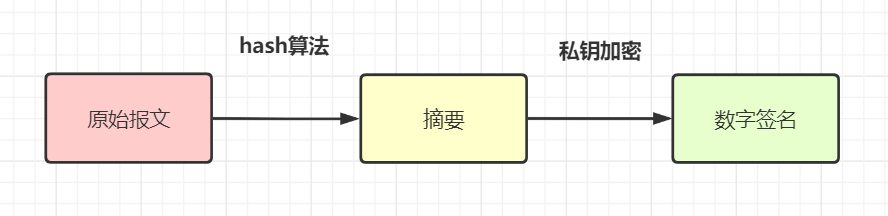
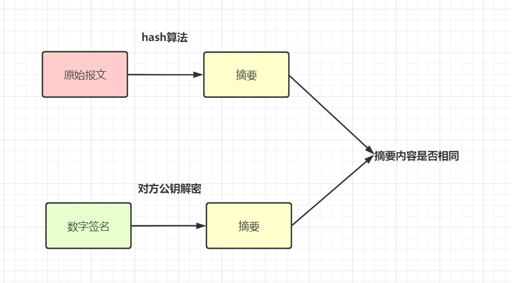
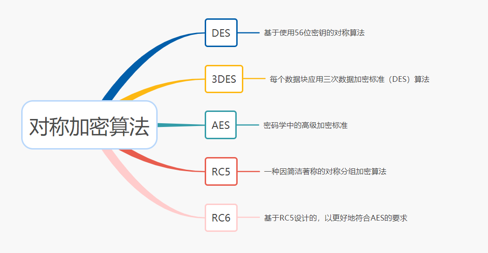
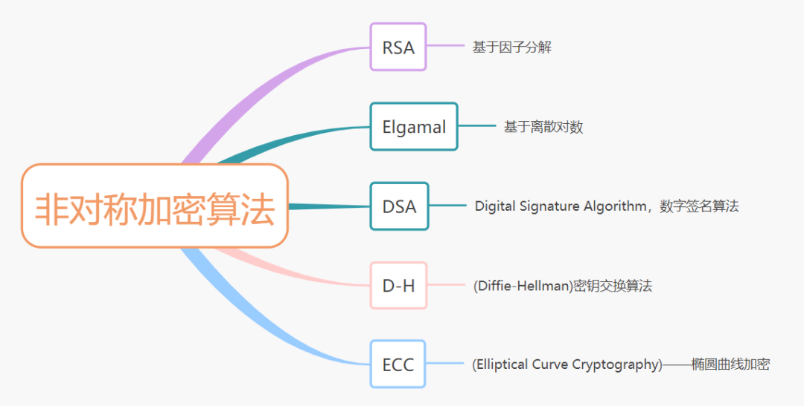
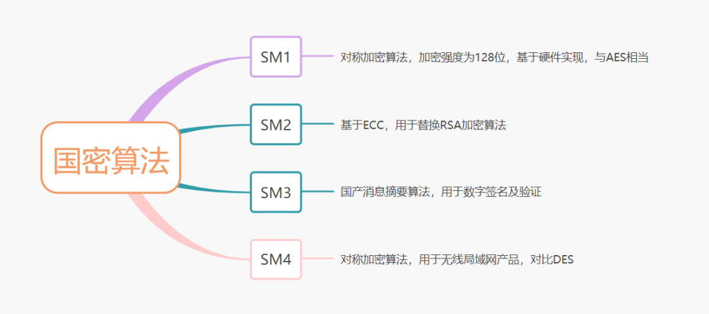

# 加签验签

- 明文：指没有经过加密的信息/数据。
- 密文：明文被加密算法加密之后，会变成密文，以确保数据安全。
- 密钥：是一种参数，它是在明文转换为密文或将密文转换为明文的算法中输入的参数。密钥分为对称密钥与非对称密钥。
- 加密：将明文变成密文的过程。
- 解密：将密文还原为明文的过程。

## 对称加密、非对称加密

对称加密：加密和解密使用相同密钥的加密算法。

非对称加密：非对称加密算法需要两个密钥（公开密钥和私有密钥）。公钥与私钥是成对存在的，如果用公钥对数据进行加密，只有对应的私钥才能解密。

## 什么是公钥私钥？

- 公钥与私钥是成对存在的密钥，如果用公钥对数据进行加密，只有用对应的私钥才能解密。

- 其实，公钥就是公开的秘钥，私钥就是要你私自保存好的秘钥。

- 非对称加密算法需要有一对公私钥~

  

**加签验签概念**

**「加签」**：用Hash函数把原始报文生成报文摘要，然后用私钥对这个摘要进行加密，就得到这个报文对应的数字签名。通常来说呢，请求方会把**「数字签名和报文原文」**一并发送给接收方。

**「验签」**：接收方拿到原始报文和数字签名后，用**「同一个Hash函数」**从报文中生成摘要A。另外，用对方提供的公钥对数字签名进行解密，得到摘要B，对比A和B是否相同，就可以得知报文有没有被篡改过。

**为什么需要加签验签**

上小节中，加签和验签我们已经知道概念啦，那么，为什么需要加签和验签呢？有些朋友可能觉得，我们不是用**「公钥加密，私钥解密」**就好了嘛？

所以呢，公钥与私钥是用来加密与加密的，**「加签与验签是用来证明身份」**，以免被篡改的。

**常见加密相关算法简介**

- 消息摘要算法
- 对称加密算法
- 非对称加密算法
- 国密算法

## 消息摘要算法：

- 相同的明文数据经过相同的消息摘要算法会得到相同的密文结果值。
- 数据经过消息摘要算法处理，得到的摘要结果值，是无法还原为处理前的数据的。
- 数据摘要算法也被称为哈希（Hash）算法或散列算法。
- 消息摘要算法一般用于签名验签。

消息摘要算法主要分三类：MD（Message Digest，消息摘要算法）、SHA（Secure Hash Algorithm，安全散列算法）和MAC（Message Authentication Code，消息认证码算法）。

#### MD家族算法

MD（Message Digest，消息摘要算法）家族，包括MD2，MD4，MD5。

- MD2，MD4，MD5 计算的结果都是是一个128位（即16字节）的散列值，用于确保信息传输完整一致。
- MD2的算法较慢但相对安全，MD4速度很快，但安全性下降，MD5则比MD4更安全、速度更快。
- MD5被广泛应用于数据完整性校验、数据（消息）摘要、数据加密等。
- MD5，可以被破解，对于需要高度安全性的数据，专家一般建议改用其他算法，如SHA-2。2004年，证实MD5算法无法防止碰撞攻击，因此不适用于安全性认证，如SSL公开密钥认证或是数字签名等用途。

#### ShA家族算法

SHA（Secure Hash Algorithm，安全散列算法），包括SHA-0、SHA-1、SHA-2(SHA-256,SHA-512,SHA-224,SHA-384等)、SHA-3。它是在MD算法基础上实现的，与MD算法区别在于**「摘要长度」**，SHA 算法的摘要**「长度更长，安全性更高」**。

#### MAC算法家族

MAC算法 MAC（Message Authentication Code，消息认证码算法），是带密钥的Hash函数。输入密钥和消息，输出一个消息摘要。它集合了MD和SHA两大系列消息摘要算法。

- MD 系列算法: HmacMD2、HmacMD4 和 HmacMD5 ；
- SHA 系列算法：HmacSHA1、HmacSHA224、HmacSHA256、HmacSHA384 和 HmacSHA512 。

## 对称加密算法

加密和解密使用**「相同密钥」**的加密算法就是对称加密算法。常见的对称加密算法有AES、3DES、DES、RC5、RC6等。

数据加密标准（英语：Data Encryption Standard，缩写为 DES）是一种对称密钥加密块密码算法。DES算法的入口参数有三个：Key、Data、Mode。

- Key: 7个字节共56位，是DES算法的工作密钥；
- Data: 8个字节64位，是要被加密或被解密的数据；
- Mode: 加密或解密。

#### 3DES

三重数据加密算法（英语：Triple Data Encryption Algorithm，又称3DES（Triple DES），是一种对称密钥加密块密码，相当于是对每个数据块应用三次数据加密标准（DES）算法。

#### AES

AES，高级加密标准（英语：Advanced Encryption Standard），在密码学中又称Rijndael加密法，是美国联邦政府采用的一种区块加密标准。

- 采用对称分组密码体制，密钥长度为 128 位、 192 位、256 位，分组长度128位
- 相对于DES ，AES具有更好的 安全性、效率 和 灵活性。

##  非对称加密算法

非对称加密算法需要两个密钥：公钥和私钥。公钥与私钥是成对存在的，如果用公钥对数据进行加密，只有用对应的私钥才能解密。主要的非对称加密算法有：RSA、Elgamal、DSA、D-H、ECC。

#### RSA算法

- RSA加密算法是一种非对称加密算法,广泛应用于加密和**数字签名**
- RSA算法原理：两个大素数的乘积进行因式分解却极其困难，因此可以将乘积公开作为加密密钥。
- RSA是被研究得最广泛的公钥算法，从提出到现在，经历了各种攻击的考验，普遍认为是目前最优秀的公钥方案之一。

#### DSA

- DSA(Digital Signature Algorithm,数字签名算法),也是一种非对称加密算法。
- DSA和RSA区别在，DSA仅用于数字签名，不能用于数据加密解密。其安全性和RSA相当，但其性能要比RSA好。

#### ECC 算法

- ECC（Elliptic Curves Cryptography，椭圆曲线密码编码学），基于椭圆曲线加密。
- Ecc主要优势是，在某些情况下，它比其他的方法使用更小的密钥，比如RSA加密算法，提供相当的或更高等级的安全级别。
- 它的一个缺点是，加密和解密操作的实现比其他机制时间长 (相比RSA算法，该算法对CPU 消耗严重)。

## 国密算法

国密即国家密码局认定的国产密码算法。为了保障商用密码的安全性，国家商用密码管理办公室制定了一系列密码标准，即SM1，SM2，SM3，SM4等国密算法。

#### SM1

- SM1，为对称加密算法，加密强度为128位，基于硬件实现。
- SM1的加密强度和性能，与AES相当。

#### SM2

- SM2主要包括三部分：签名算法、密钥交换算法、加密算法
- SM2用于替换RSA加密算法，基于ECC，效率较低。

#### SM3

- SM3，即国产消息摘要算法。
- 适用于商用密码应用中的数字签名和验证，消息认证码的生成与验证以及随机数的生成。

#### SM4

- SM4是一个分组算法，用于无线局域网产品。
- 该算法的分组长度为128比特，密钥长度为128比特。
- 加密算法与密钥扩展算法都采用32轮非线性迭代结构。
- 解密算法与加密算法的结构相同，只是轮密钥的使用顺序相反，解密轮密钥是加密轮密钥的逆序。
- 它的功能类似国际算法的DES。

