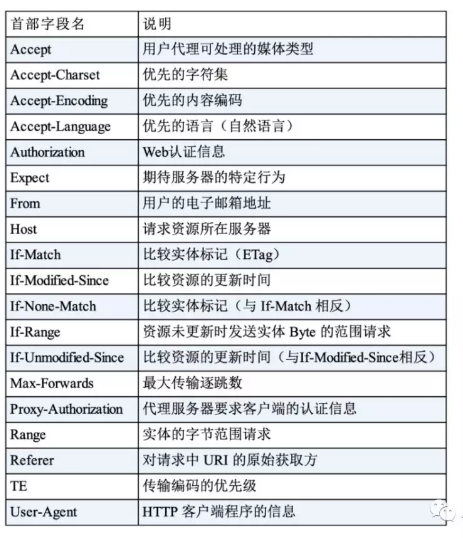
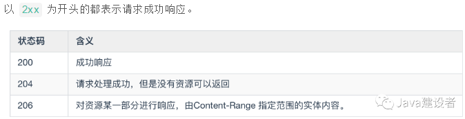
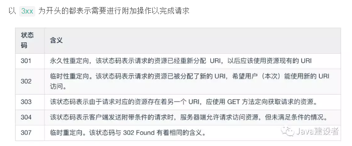
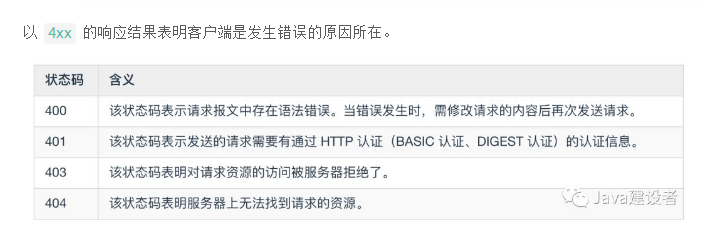
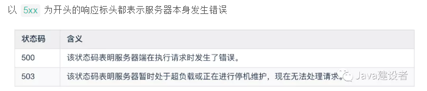
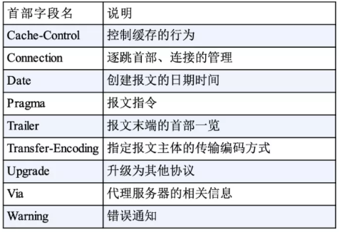
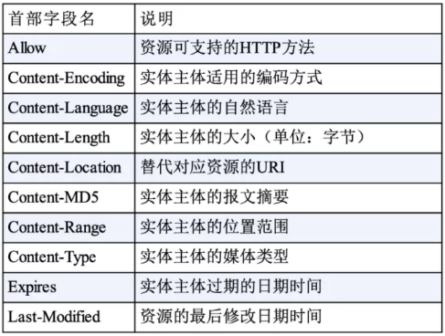
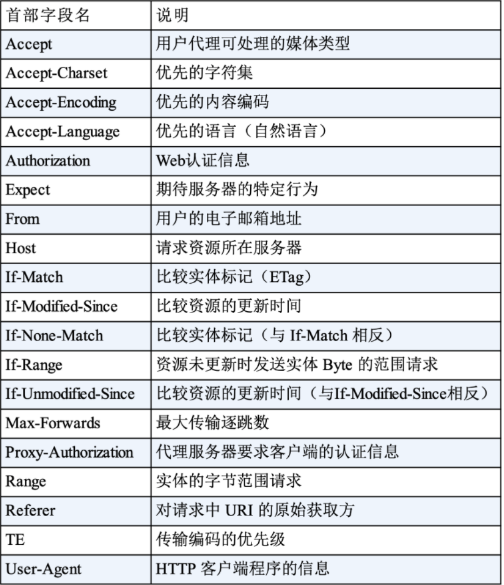
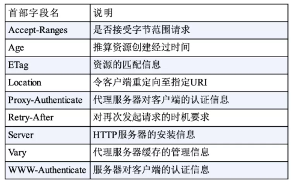
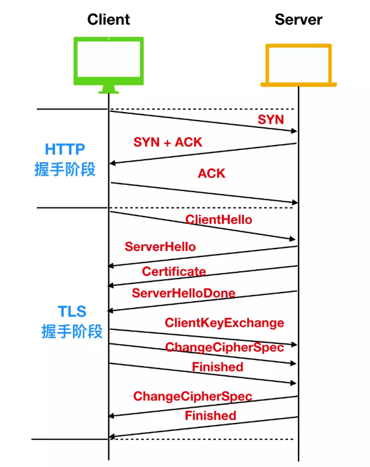

# HTTP扯皮大全

## 认识HTTP

1、**什么是HTTP?**

```
超文本传输协议(Hypertext Transfer Protocol)
超文本（Hypertext）、传输（Transfer）、协议（Protocol）
```

2、**什么是超文本**？

```
在互联网早期的时候，我们输入的信息只能保存在本地，无法和其他电脑进行交互。我们保存的信息通常都以文本即简单字符的形式存在，文本是一种能够被计算机解析的有意义的二进制数据包。而随着互联网的高速发展，两台电脑之间能够进行数据的传输后，人们不满足只能在两台电脑之间传输文字，还想要传输图片、音频、视频，甚至点击文字或图片能够进行超链接的跳转，那么文本的语义就被扩大了，这种语义扩大后的文本就被称为超文本(Hypertext)。
```

3、**什么是传输**？

```
那么我们上面说到，两台计算机之间会形成互联关系进行通信，我们存储的超文本会被解析成为二进制数据包，由传输载体（例如同轴电缆，电话线，光缆）负责把二进制数据包由计算机终端传输到另一个终端的过程
通常我们把传输数据包的一方称为请求方，把接到二进制数据包的一方称为应答方。请求方和应答方可以进行互换，请求方也可以作为应答方接受数据，应答方也可以作为请求方请求数据
```

4、**什么是协议**？

```
协议这个名词不仅局限于互联网范畴，也体现在日常生活中，比如情侣双方约定好在哪个地点吃饭，这个约定也是一种协议，比如你应聘成功了，企业会和你签订劳动合同，这种双方的雇佣关系也是一种 协议。注意自己一个人对自己的约定不能成为协议，协议的前提条件必须是多人约定。
那么网络协议是什么呢？
网络协议就是网络中(包括互联网)传递、管理信息的一些规范。如同人与人之间相互交流是需要遵循一定的规矩一样，计算机之间的相互通信需要共同遵守一定的规则，这些规则就称为网络协议。
没有网络协议的互联网是混乱的，就和人类社会一样，人不能想怎么样就怎么样，你的行为约束是受到法律的约束的；那么互联网中的端系统也不能自己想发什么发什么，也是需要受到通信协议约束的。
那么我们就可以总结一下，什么是 HTTP？可以用下面这个经典的总结回答一下：HTTP 是一个在计算机世界里专门在两点之间传输文字、图片、音频、视频等超文本数据的约定和规范
```

## 与 HTTP 有关的组件

1、**网络模型**

```
网络是一个复杂的系统，不仅包括大量的应用程序、端系统、通信链路、分组交换机等，还有各种各样的协议组成，那么现在我们就来聊一下网络中的协议层次。
为了给网络协议的设计提供一个结构，网络设计者以分层(layer)的方式组织协议，每个协议属于层次模型之一。每一层都是向它的上一层提供服务(service)，即所谓的服务模型(service model)。每个分层中所有的协议称为 协议栈(protocol stack)。因特网的协议栈由五个部分组成：物理层、链路层、网络层、运输层和应用层。我们采用自上而下的方法研究其原理，也就是应用层 -> 物理层的方式。
```

2、**应用层**

```
应用层是网络应用程序和网络协议存放的分层，因特网的应用层包括许多协议，例如我们学 web 离不开的 HTTP，电子邮件传送协议 SMTP、端系统文件上传协议 FTP、还有为我们进行域名解析的 DNS 协议。应用层协议分布在多个端系统上，一个端系统应用程序与另外一个端系统应用程序交换信息分组，我们把位于应用层的信息分组称为 报文(message)。
```

3、**运输层**

```
因特网的运输层在应用程序断点之间传送应用程序报文，在这一层主要有两种传输协议 TCP和 UDP，利用这两者中的任何一个都能够传输报文，不过这两种协议有巨大的不同。
TCP 向它的应用程序提供了面向连接的服务，它能够控制并确认报文是否到达，并提供了拥塞机制来控制网络传输，因此当网络拥塞时，会抑制其传输速率。
UDP 协议向它的应用程序提供了无连接服务。它不具备可靠性的特征，没有流量控制，也没有拥塞控制。我们把运输层的分组称为 报文段(segment) 
```

4、**网络层**

```
因特网的网络层负责将称为 数据报(datagram) 的网络分层从一台主机移动到另一台主机。网络层一个非常重要的协议是 IP 协议，所有具有网络层的因特网组件都必须运行 IP 协议，IP 协议是一种网际协议，除了 IP 协议外，网络层还包括一些其他网际协议和路由选择协议，一般把网络层就称为 IP 层，由此可知 IP 协议的重要性。
```

5、**链路层**

```
现在我们有应用程序通信的协议，有了给应用程序提供运输的协议，还有了用于约定发送位置的 IP 协议，那么如何才能真正的发送数据呢？为了将分组从一个节点（主机或路由器）运输到另一个节点，网络层必须依靠链路层提供服务。链路层的例子包括以太网、WiFi 和电缆接入的 DOCSIS 协议，因为数据从源目的地传送通常需要经过几条链路，一个数据包可能被沿途不同的链路层协议处理，我们把链路层的分组称为帧(frame)
```

6、**物理层**

```
虽然链路层的作用是将帧从一个端系统运输到另一个端系统，而物理层的作用是将帧中的一个个 比特 从一个节点运输到另一个节点，物理层的协议仍然使用链路层协议，这些协议与实际的物理传输介质有关，例如，以太网有很多物理层协议：关于双绞铜线、关于同轴电缆、关于光纤等等。
```

7、五层网络协议

```
1、应用层
2、运输层
3、网络层
4、链路层
5、物理层
```

8、OSI七层模型？

```
1、应用层
2、表示层
3、会话层
4、运输层
5、网络层
6、数据链路层
7、物理层
```

9、**浏览器**

```
就如同各大邮箱使用电子邮件传送协议 SMTP 一样，浏览器是使用 HTTP 协议的主要载体，说到浏览器浏览器正式的名字叫做 Web Broser，顾名思义，就是检索、查看互联网上网页资源的应用程序，名字里的 Web，实际上指的就是 World Wide Web，也就是万维网。
我们在地址栏输入URL（即网址），浏览器会向DNS（域名服务器，后面会说）提供网址，由它来完成 URL 到 IP 地址的映射。然后将请求你的请求提交给具体的服务器，在由服务器返回我们要的结果（以HTML编码格式返回给浏览器），浏览器执行HTML编码，将结果显示在浏览器的正文。这就是一个浏览器发起请求和接受响应的过程。
```

10、**Web 服务器**

```
Web 服务器的正式名称叫做 Web Server，Web 服务器一般指的是网站服务器，上面说到浏览器是 HTTP 请求的发起方，那么 Web 服务器就是 HTTP 请求的应答方，Web 服务器可以向浏览器等 Web 客户端提供文档，也可以放置网站文件，让全世界浏览；可以放置数据文件，让全世界下载。目前最主流的三个Web服务器是Apache、 Nginx 、IIS。
```

12、**CDN**

```
CDN的全称是Content Delivery Network，即内容分发网络，它应用了 HTTP 协议里的缓存和代理技术，代替源站响应客户端的请求。CDN 是构建在现有网络基础之上的网络，它依靠部署在各地的边缘服务器，通过中心平台的负载均衡、内容分发、调度等功能模块，使用户就近获取所需内容，降低网络拥塞，提高用户访问响应速度和命中率。CDN的关键技术主要有内容存储和分发技术。
打比方说你要去亚马逊上买书，之前你只能通过购物网站购买后从美国发货过海关等重重关卡送到你的家里，现在在中国建立一个亚马逊分基地，你就不用通过美国进行邮寄，从中国就能把书尽快给你送到。
```

13、**WAF**

```
WAF 是一种 Web 应用程序防护系统（Web Application Firewall，简称 WAF），它是一种通过执行一系列针对HTTP / HTTPS的安全策略来专门为Web应用提供保护的一款产品，它是应用层面的防火墙，专门检测 HTTP 流量，是防护 Web 应用的安全技术。
WAF 通常位于 Web 服务器之前，可以阻止如 SQL 注入、跨站脚本等攻击，目前应用较多的一个开源项目是 ModSecurity，它能够完全集成进 Apache 或 Nginx。
```

14、**WebService**

```
WebService 是一种 Web 应用程序，WebService是一种跨编程语言和跨操作系统平台的远程调用技术。
Web Service 是一种由 W3C 定义的应用服务开发规范，使用 client-server 主从架构，通常使用 WSDL 定义服务接口，使用 HTTP 协议传输 XML 或 SOAP 消息，它是一个基于 Web（HTTP）的服务架构技术，既可以运行在内网，也可以在适当保护后运行在外网。
```

15、**HTML**

```
HTML 称为超文本标记语言，是一种标识性的语言。它包括一系列标签．通过这些标签可以将网络上的文档格式统一，使分散的 Internet 资源连接为一个逻辑整体。HTML 文本是由 HTML 命令组成的描述性文本，HTML 命令可以说明文字，图形、动画、声音、表格、链接等。
```

16、**Web 页面构成**

```
Web 页面（Web page）也叫做文档，是由一个个对象组成的。一个对象(Objecy) 只是一个文件，比如一个 HTML 文件、一个 JPEG 图形、一个 Java 小程序或一个视频片段，它们在网络中可以通过 URL 地址寻址。多数的 Web 页面含有一个 HTML 基本文件 以及几个引用对象。
举个例子，如果一个 Web 页面包含 HTML 文件和5个 JPEG 图形，那么这个 Web 页面就有6个对象：一个 HTML 文件和5个 JPEG 图形。HTML 基本文件通过 URL 地址引用页面中的其他对象。
```

## 与 HTTP 有关的协议

1、**TCP/IP**

```
TCP/IP 协议你一定听过，TCP/IP 我们一般称之为协议簇，什么意思呢？就是 TCP/IP 协议簇中不仅仅只有 TCP 协议和 IP 协议，它是一系列网络通信协议的统称。而其中最核心的两个协议就是 TCP / IP 协议，其他的还有 UDP、ICMP、ARP 等等，共同构成了一个复杂但有层次的协议栈。
TCP 协议的全称是 Transmission Control Protocol 的缩写，意思是传输控制协议，HTTP 使用 TCP 作为通信协议，这是因为 TCP 是一种可靠的协议，而可靠能保证数据不丢失。
IP 协议的全称是 Internet Protocol 的缩写，它主要解决的是通信双方寻址的问题。IP 协议使用 IP 地址 来标识互联网上的每一台计算机，可以把 IP 地址想象成为你手机的电话号码，你要与他人通话必须先要知道他人的手机号码，计算机网络中信息交换必须先要知道对方的 IP 地址。（关于 TCP 和 IP 更多的讨论我们会在后面详解）
```

2、**DNS**

```
你有没有想过为什么你可以通过键入 www.google.com 就能够获取你想要的网站？我们上面说到，计算机网络中的每个端系统都有一个 IP 地址存在，而把 IP 地址转换为便于人类记忆的协议就是 DNS 协议。
DNS 的全称是域名系统（Domain Name System，缩写：DNS），它作为将域名和 IP 地址相互映射的一个分布式数据库，能够使人更方便地访问互联网。
```

3、**URI / URL**

```
我们上面提到，你可以通过输入 www.google.com 地址来访问谷歌的官网，那么这个地址有什么规定吗？我怎么输都可以？AAA.BBB.CCC 是不是也行？当然不是的，你输入的地址格式必须要满足 URI 的规范。
URI的全称是（Uniform Resource Identifier），中文名称是统一资源标识符，使用它就能够唯一地标记互联网上资源。
URL的全称是（Uniform Resource Locator），中文名称是统一资源定位符，也就是我们俗称的网址，它实际上是 URI 的一个子集。
URI 不仅包括 URL，还包括 URN（统一资源名称）
```

4、**HTTPS**

```
HTTP 一般是明文传输，很容易被攻击者窃取重要信息，鉴于此，HTTPS 应运而生。HTTPS 的全称为 （Hyper Text Transfer Protocol over SecureSocket Layer），全称有点长，HTTPS 和 HTTP 有很大的不同在于 HTTPS 是以安全为目标的 HTTP 通道，在 HTTP 的基础上通过传输加密和身份认证保证了传输过程的安全性。HTTPS 在 HTTP 的基础上增加了 SSL 层，也就是说 HTTPS = HTTP + SSL。（这块我们后面也会详谈 HTTPS）
```

## HTTP 请求响应过程

1、请求响应过程？

```
你是不是很好奇，当你在浏览器中输入网址后，到底发生了什么事情？你想要的内容是如何展现出来的？让我们通过一个例子来探讨一下，我们假设访问的 URL 地址为 http://www.someSchool.edu/someDepartment/home.index，当我们输入网址并点击回车时，浏览器内部会进行如下操作
DNS服务器会首先进行域名的映射，找到访问www.someSchool.edu所在的地址，然后HTTP 客户端进程在 80 端口发起一个到服务器 www.someSchool.edu 的 TCP 连接（80 端口是 HTTP 的默认端口）。在客户和服务器进程中都会有一个套接字与其相连。
HTTP 客户端通过它的套接字向服务器发送一个 HTTP 请求报文。该报文中包含了路径 someDepartment/home.index 的资源，我们后面会详细讨论 HTTP 请求报文。
HTTP 服务器通过它的套接字接受该报文，进行请求的解析工作，并从其存储器(RAM 或磁盘)中检索出对象 www.someSchool.edu/someDepartment/home.index，然后把检索出来的对象进行封装，封装到 HTTP 响应报文中，并通过套接字向客户进行发送。
HTTP 服务器随即通知 TCP 断开 TCP 连接，实际上是需要等到客户接受完响应报文后才会断开 TCP 连接。
HTTP 客户端接受完响应报文后，TCP 连接会关闭。HTTP 客户端从响应中提取出报文中是一个 HTML 响应文件，并检查该 HTML 文件，然后循环检查报文中其他内部对象。
检查完成后，HTTP 客户端会把对应的资源通过显示器呈现给用户。
至此，键入网址再按下回车的全过程就结束了。上述过程描述的是一种简单的请求-响应全过程，真实的请求-响应情况可能要比上面描述的过程复杂很多。
```

2、HTTP 请求特征

```
从上面整个过程中我们可以总结出 HTTP 进行分组传输是具有以下特征
支持客户-服务器模式
简单快速：客户向服务器请求服务时，只需传送请求方法和路径。请求方法常用的有 GET、HEAD、POST。每种方法规定了客户与服务器联系的类型不同。由于 HTTP 协议简单，使得 HTTP 服务器的程序规模小，因而通信速度很快。
灵活：HTTP 允许传输任意类型的数据对象。正在传输的类型由 Content-Type 加以标记。
无连接：无连接的含义是限制每次连接只处理一个请求。服务器处理完客户的请求，并收到客户的应答后，即断开连接。采用这种方式可以节省传输时间。
无状态：HTTP 协议是无状态协议。无状态是指协议对于事务处理没有记忆能力。缺少状态意味着如果后续处理需要前面的信息，则它必须重传，这样可能导致每次连接传送的数据量增大。另一方面，在服务器不需要先前信息时它的应答就较快。
```

## 详解 HTTP 报文

1、HTTP协议组成？

```
起始行（start line）：描述请求或响应的基本信息；
头部字段（header）：使用 key-value 形式更详细地说明报文；
消息正文（entity）：实际传输的数据，它不一定是纯文本，可以是图片、视频等二进制数据

其中起始行和头部字段并成为 请求头 或者 响应头，统称为 Header；消息正文也叫做实体，称为 body。HTTP 协议规定每次发送的报文必须要有 Header，但是可以没有 body，也就是说头信息是必须的，实体信息可以没有。而且在 header 和 body 之间必须要有一个空行（CRLF）
每个报文的起始行都是由三个字段组成：方法、URL 字段和 HTTP 版本字段
```

2、**HTTP 请求方法**

```
HTTP 请求方法一般分为 8 种，它们分别是
GET 获取资源，GET 方法用来请求访问已被 URI 识别的资源。指定的资源经服务器端解析后返回响应内容。也就是说，如果请求的资源是文本，那就保持原样返回；
POST 传输实体，虽然 GET 方法也可以传输主体信息，但是便于区分，我们一般不用 GET 传输实体信息，反而使用 POST 传输实体信息，
PUT 传输文件，PUT 方法用来传输文件。就像 FTP 协议的文件上传一样，要求在请求报文的主体中包含文件内容，然后保存到请求 URI 指定的位置。
但是，鉴于 HTTP 的 PUT 方法自身不带验证机制，任何人都可以上传文件 , 存在安全性问题，因此一般的 W eb 网站不使用该方法。若配合 W eb 应用程序的验证机制，或架构设计采用REST（REpresentational State Transfer，表征状态转移）标准的同类 Web 网站，就可能会开放使用 PUT 方法。
HEAD 获得响应首部，HEAD 方法和 GET 方法一样，只是不返回报文主体部分。用于确认 URI 的有效性及资源更新的日期时间等。
DELETE 删除文件，DELETE 方法用来删除文件，是与 PUT 相反的方法。DELETE 方法按请求 URI 删除指定的资源。
OPTIONS 询问支持的方法，OPTIONS 方法用来查询针对请求 URI 指定的资源支持的方法。
TRACE 追踪路径，TRACE 方法是让 Web 服务器端将之前的请求通信环回给客户端的方法。
CONNECT 要求用隧道协议连接代理，CONNECT 方法要求在与代理服务器通信时建立隧道，实现用隧道协议进行 TCP 通信。主要使用 SSL（Secure Sockets Layer，安全套接层）和 TLS（Transport Layer Security，传输层安全）协议把通信内容加 密后经网络隧道传输。
```

3、**HTTP 请求 URL**

```
http://www.example.com:80/path/to/myfile.html?key1=value1&key2=value2#SomewhereInTheDocument
首先出场的是 http
http://告诉浏览器使用何种协议。对于大部分 Web 资源，通常使用 HTTP 协议或其安全版本，HTTPS 协议。另外，浏览器也知道如何处理其他协议。例如， mailto: 协议指示浏览器打开邮件客户端；ftp:协议指示浏览器处理文件传输。
第二个出场的是 主机
www.example.com 既是一个域名，也代表管理该域名的机构。它指示了需要向网络上的哪一台主机发起请求。当然，也可以直接向主机的 IP address 地址发起请求。但直接使用 IP 地址的场景并不常见。
第三个出场的是 端口
我们前面说到，两个主机之间要发起 TCP 连接需要两个条件，主机 + 端口。它表示用于访问 Web 服务器上资源的入口。如果访问的该 Web 服务器使用HTTP协议的标准端口（HTTP为80，HTTPS为443）授予对其资源的访问权限，则通常省略此部分。否则端口就是 URI 必须的部分。
上面是请求 URL 所必须包含的部分，下面就是 URL 具体请求资源路径
第四个出场的是 路径
/path/to/myfile.html 是 Web 服务器上资源的路径。以端口后面的第一个 / 开始，到 ? 号之前结束，中间的 每一个/ 都代表了层级（上下级）关系。这个 URL 的请求资源是一个 html 页面。
紧跟着路径后面的是 查询参数
第五个出场的是 查询参数
?key1=value1&key2=value2 是提供给 Web 服务器的额外参数。如果是 GET 请求，一般带有请求 URL 参数，如果是 POST 请求，则不会在路径后面直接加参数。这些参数是用 & 符号分隔的键/值对列表。key1 = value1 是第一对，key2 = value2 是第二对参数
第六个出场的是 锚点
#SomewhereInTheDocument 是资源本身的某一部分的一个锚点。锚点代表资源内的一种“书签”，它给予浏览器显示位于该“加书签”点的内容的指示。例如，在HTML文档上，浏览器将滚动到定义锚点的那个点上；在视频或音频文档上，浏览器将转到锚点代表的那个时间。值得注意的是 # 号后面的部分，也称为片段标识符，永远不会与请求一起发送到服务器。
```

4、**HTTP 版本**

```
表示报文使用的 HTTP 协议版本。
```

5、**请求头部**

```
在表述完了起始行之后我们再来看一下请求头部，现在我们向上找，找到http://www.someSchool.edu/someDepartment/home.index，来看一下它的请求头部
Host: www.someschool.edu
Connection: close
User-agent: Mozilla/5.0
Accept-language: fr
这个请求头信息比较少，首先 Host 表示的是对象所在的主机。你也许认为这个 Host 是不需要的，因为 URL 不是已经指明了请求对象的路径了吗？这个首部行提供的信息是 Web 代理高速缓存所需要的。Connection: close 表示的是浏览器需要告诉服务器使用的是非持久连接。它要求服务器在发送完响应的对象后就关闭连接。User-agent: 这是请求头用来告诉 Web 服务器，浏览器使用的类型是 Mozilla/5.0，即 Firefox 浏览器。Accept-language 告诉 Web 服务器，浏览器想要得到对象的法语版本，前提是服务器需要支持法语类型，否则将会发送服务器的默认版本。
```

6、**内容协商**

```
内容协商机制是指客户端和服务器端就响应的资源内容进行交涉，然后提供给客户端最为适合的资源。内容协商会以响应资源的语言、字符集、编码方式等作为判断的标准。
内容协商主要有以下3种类型：
服务器驱动协商（Server-driven Negotiation）
这种协商方式是由服务器端进行内容协商。服务器端会根据请求首部字段进行自动处理
客户端驱动协商（Agent-driven Negotiation）
这种协商方式是由客户端来进行内容协商。
透明协商（Transparent Negotiation）
是服务器驱动和客户端驱动的结合体，是由服务器端和客户端各自进行内容协商的一种方法。
内容协商的分类有很多种，主要的几种类型是 Accept、Accept-Charset、Accept-Encoding、Accept-Language、Content-Language。
```



7、**响应状态码**









8、HTTP 的优点

```
1、简单灵活易扩展
HTTP 最重要也是最突出的优点是 简单、灵活、易于扩展。
HTTP 的协议比较简单，它的主要组成就是 header + body，头部信息也是简单的文本格式，而且 HTTP 的请求报文根据英文也能猜出来个大概的意思，降低学习门槛，能够让更多的人研究和开发 HTTP 应用。
所以，在简单的基础上，HTTP 协议又多了灵活 和 易扩展 的优点。
HTTP 协议里的请求方法、URI、状态码、原因短语、头字段等每一个核心组成要素都没有被制定死，允许开发者任意定制、扩充或解释，给予了浏览器和服务器最大程度的信任和自由。
2、应用广泛、环境成熟
因为过于简单，普及，因此应用很广泛。因为 HTTP 协议本身不属于一种语言，它并不限定某种编程语言或者操作系统，所以天然具有跨语言、跨平台的优越性。而且，因为本身的简单特性很容易实现，所以几乎所有的编程语言都有 HTTP 调用库和外围的开发测试工具。
随着移动互联网的发展， HTTP 的触角已经延伸到了世界的每一个角落，从简单的 Web 页面到复杂的 JSON、XML 数据，从台式机上的浏览器到手机上的各种 APP、新闻、论坛、购物、手机游戏，你很难找到一个没有使用 HTTP 的地方。
3、无状态
无状态其实既是优点又是缺点。因为服务器没有记忆能力，所以就不需要额外的资源来记录状态信息，不仅实现上会简单一些，而且还能减轻服务器的负担，能够把更多的 CPU 和内存用来对外提供服务。
```

9、缺点？

```
1、无状态
既然服务器没有记忆能力，它就无法支持需要连续多个步骤的事务操作。每次都得问一遍身份信息，不仅麻烦，而且还增加了不必要的数据传输量。由此出现了 Cookie 技术。
2、明文
HTTP 协议里还有一把优缺点一体的双刃剑，就是明文传输。明文意思就是协议里的报文（准确地说是 header 部分）不使用二进制数据，而是用简单可阅读的文本形式。
对比 TCP、UDP 这样的二进制协议，它的优点显而易见，不需要借助任何外部工具，用浏览器、Wireshark 或者 tcpdump 抓包后，直接用肉眼就可以很容易地查看或者修改，为我们的开发调试工作带来极大的便利。
当然缺点也是显而易见的，就是不安全，可以被监听和被窥探。因为无法判断通信双方的身份，不能判断报文是否被更改过。
3、性能
HTTP 的性能不算差，但不完全适应现在的互联网，还有很大的提升空间。
```

3、简述 HTTP1.0/1.1/2.0 的区别？

###### HTTP 1.0

```
HTTP 1.0 是在 1996 年引入的，从那时开始，它的普及率就达到了惊人的效果。

HTTP 1.0 仅仅提供了最基本的认证，这时候用户名和密码还未经加密，因此很容易收到窥探。
HTTP 1.0 被设计用来使用短链接，即每次发送数据都会经过 TCP 的三次握手和四次挥手，效率比较低。
HTTP 1.0 只使用 header 中的 If-Modified-Since 和 Expires 作为缓存失效的标准。
HTTP 1.0 不支持断点续传，也就是说，每次都会传送全部的页面和数据。
HTTP 1.0 认为每台计算机只能绑定一个 IP，所以请求消息中的 URL 并没有传递主机名（hostname）。
```

###### HTTP 1.1

```
HTTP 1.1 是 HTTP 1.0 开发三年后出现的，也就是 1999 年，它做出了以下方面的变化

HTTP 1.1 使用了摘要算法来进行身份验证
HTTP 1.1 默认使用长连接，长连接就是只需一次建立就可以传输多次数据，传输完成后，只需要一次切断连接即可。长连接的连接时长可以通过请求头中的 keep-alive 来设置
HTTP 1.1 中新增加了 E-tag，If-Unmodified-Since, If-Match, If-None-Match 等缓存控制标头来控制缓存失效。
HTTP 1.1 支持断点续传，通过使用请求头中的 Range 来实现。
HTTP 1.1 使用了虚拟网络，在一台物理服务器上可以存在多个虚拟主机（Multi-homed Web Servers），并且它们共享一个IP地址。
```

###### HTTP 2.0

```
HTTP 2.0 是 2015 年开发出来的标准，它主要做的改变如下：
头部压缩，由于 HTTP 1.1 经常会出现 User-Agent、Cookie、Accept、Server、Range 等字段可能会占用几百甚至几千字节，而 Body 却经常只有几十字节，所以导致头部偏重。HTTP 2.0 使用 HPACK 算法进行压缩。
二进制格式，HTTP 2.0 使用了更加靠近 TCP/IP 的二进制格式，而抛弃了 ASCII 码，提升了解析效率
强化安全，由于安全已经成为重中之重，所以 HTTP2.0 一般都跑在 HTTPS 上。
多路复用，即每一个请求都是是用作连接共享。一个请求对应一个id，这样一个连接上可以有多个请求。
```

4、请你说一下 HTTP 常见的请求头？

通用标头主要有三个，分别是 `Date`、`Cache-Control` 和 `Connection`

**Date**

```
Date 是一个通用标头，它可以出现在请求标头和响应标头中，它的基本表示如下：
Date: Wed, 21 Oct 2015 07:28:00 GMT 
表示的是格林威治标准时间，这个时间要比北京时间慢八个小时
```

**Cache-Control**

```
Cache-Control 是一个通用标头，他可以出现在请求标头和响应标头中，Cache-Control 的种类比较多，虽然说这是一个通用标头，但是有一些特性是请求标头具有的，有一些是响应标头才有的。主要大类有 可缓存性、阈值性、 重新验证并重新加载 和其他特性
```

**Connection**

```
Connection 决定当前事务（一次三次握手和四次挥手）完成后，是否会关闭网络连接。Connection 有两种，一种是持久性连接，即一次事务完成后不关闭网络连接
Connection: keep-alive
另一种是非持久性连接，即一次事务完成后关闭网络连接
Connection: close
```



###### 实体标头

实体标头是描述消息正文内容的 HTTP 标头。实体标头用于 HTTP 请求和响应中。头部`Content-Length`、 `Content-Language`、 `Content-Encoding` 是实体头。

- Content-Length 实体报头指示实体主体的大小，以字节为单位，发送到接收方。

- Content-Language 实体报头描述了客户端或者服务端能够接受的语言。

- Content-Encoding 这又是一个比较麻烦的属性，这个实体报头用来压缩媒体类型。Content-Encoding 指示对实体应用了何种编码。

  常见的内容编码有这几种： **gzip、compress、deflate、identity** ，这个属性可以应用在请求报文和响应报文中

```
Accept-Encoding: gzip, deflate //请求头
Content-Encoding: gzip  //响应头
```



###### 请求标头

**Host**

```
Host 请求头指明了服务器的域名（对于虚拟主机来说），以及（可选的）服务器监听的 TCP 端口号。如果没有给定端口号，会自动使用被请求服务的默认端口（比如请求一个 HTTP 的 URL 会自动使用 80 作为端口）
```

**Referer**

```
HTTP Referer 属性是请求标头的一部分，当浏览器向 web 服务器发送请求的时候，一般会带上 Referer，告诉服务器该网页是从哪个页面链接过来的，服务器因此可以获得一些信息用于处理。
```

**If-Modified-Since**

```
If-Modified-Since 通常会与 If-None-Match 搭配使用，If-Modified-Since 用于确认代理或客户端拥有的本地资源的有效性。获取资源的更新日期时间，可通过确认首部字段 Last-Modified 来确定。
大白话说就是如果在 Last-Modified 之后更新了服务器资源，那么服务器会响应 200，如果在 Last-Modified 之后没有更新过资源，则返回 304。
```

**If-None-Match**

```
If-None-Match HTTP 请求标头使请求成为条件请求。对于 GET 和 HEAD 方法，仅当服务器没有与给定资源匹配的 ETag 时，服务器才会以 200 状态发送回请求的资源。对于其他方法，仅当最终现有资源的ETag与列出的任何值都不匹配时，才会处理请求。
```

**Accept**

```
接受请求 HTTP 标头会通告客户端其能够理解的 MIME 类型
```

**Accept-Charset**

```
accept-charset 属性规定服务器处理表单数据所接受的字符集。

常用的字符集有：UTF-8 - Unicode 字符编码 ；ISO-8859-1 - 拉丁字母表的字符编码
```

**Accept-Language**

```
首部字段 Accept-Language 用来告知服务器用户代理能够处理的自然语言集（指中文或英文等），以及自然语言集的相对优先级。可一次指定多种自然语言集。

请求标头我们大概就介绍这几种，后面会有一篇文章详细深挖所有的响应头的，下面是一个响应头的汇总，基于 HTTP 1.1
```



###### 响应标头

**Access-Control-Allow-Origin**

```
一个返回的 HTTP 标头可能会具有 Access-Control-Allow-Origin ，Access-Control-Allow-Origin 指定一个来源，它告诉浏览器允许该来源进行资源访问。
```

**Keep-Alive**

```
Keep-Alive 表示的是 Connection 非持续连接的存活时间，可以进行指定。
```

**Server**

```
服务器标头包含有关原始服务器用来处理请求的软件的信息。

应该避免使用过于冗长和详细的 Server 值，因为它们可能会泄露内部实施细节，这可能会使攻击者容易地发现并利用已知的安全漏洞
```

**Set-Cookie**

```
Set-Cookie 用于服务器向客户端发送 sessionID。
```

**Transfer-Encoding**

```
首部字段 Transfer-Encoding 规定了传输报文主体时采用的编码方式。

HTTP /1.1 的传输编码方式仅对分块传输编码有效。
```

**X-Frame-Options**

```
HTTP 首部字段是可以自行扩展的。所以在 Web 服务器和浏览器的应用上，会出现各种非标准的首部字段。

首部字段 X-Frame-Options 属于 HTTP 响应首部，用于控制网站内容在其他 Web 网站的 Frame 标签内的显示问题。其主要目的是为了防止点击劫持（clickjacking）攻击。
```



## HTTPS 的工作原理

TLS 旨在为 Internet 提供通信安全的加密协议。TLS 握手是启动和使用 TLS 加密的通信会话的过程。在 TLS 握手期间，Internet 中的通信双方会彼此交换信息，验证密码套件，交换会话密钥。

每当用户通过 HTTPS 导航到具体的网站并发送请求时，就会进行 TLS 握手。除此之外，每当其他任何通信使用HTTPS（包括 API 调用和在 HTTPS 上查询 DNS）时，也会发生 TLS 握手。

TLS 具体的握手过程会根据所使用的`密钥交换算法的类型`和双方支持的`密码套件`而不同。我们以`RSA 非对称加密`来讨论这个过程。整个 TLS 通信流程图如下：



- 在进行通信前，首先会进行 HTTP 的三次握手，握手完成后，再进行 TLS 的握手过程

- ClientHello：客户端通过向服务器发送 `hello` 消息来发起握手过程。这个消息中会夹带着客户端支持的 `TLS 版本号(TLS1.0 、TLS1.2、TLS1.3)` 、客户端支持的密码套件、以及一串 `客户端随机数`。

- ServerHello：在客户端发送 hello 消息后，服务器会发送一条消息，这条消息包含了服务器的 SSL 证书、服务器选择的密码套件和服务器生成的随机数。

- 认证(Authentication)：客户端的证书颁发机构会认证 SSL 证书，然后发送 `Certificate` 报文，报文中包含公开密钥证书。最后服务器发送 `ServerHelloDone` 作为 `hello` 请求的响应。第一部分握手阶段结束。

- `加密阶段`：在第一个阶段握手完成后，客户端会发送 `ClientKeyExchange` 作为响应，这个响应中包含了一种称为 `The premaster secret` 的密钥字符串，这个字符串就是使用上面公开密钥证书进行加密的字符串。随后客户端会发送 `ChangeCipherSpec`，告诉服务端使用私钥解密这个 `premaster secret` 的字符串，然后客户端发送 `Finished` 告诉服务端自己发送完成了。

- > Session key 其实就是用公钥证书加密的公钥。

  - `实现了安全的非对称加密`：然后，服务器再发送 `ChangeCipherSpec` 和 `Finished` 告诉客户端解密完成，至此实现了 RSA 的非对称加密。

