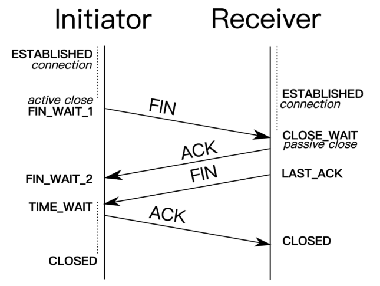

## TCP与UDP

1、UDP 是什么?

```
UDP 的全称是 User Datagram Protocol，用户数据报协议。它不需要所谓的握手操作，从而加快了通信速度，允许网络上的其他主机在接收方同意通信之前进行数据传输。
```

2、UDP的特点？

```
UDP 能够支持容忍数据包丢失的带宽密集型应用程序
UDP 具有低延迟的特点
UDP 能够发送大量的数据包
UDP 能够允许 DNS 查找，DNS 是建立在 UDP 之上的应用层协议。
```

3、TCP 是什么？

```
TCP 的全称是Transmission Control Protocol ，传输控制协议。它能够帮助你确定计算机连接到 Internet 以及它们之间的数据传输。通过三次握手来建立 TCP 连接，三次握手就是用来启动和确认 TCP 连接的过程。一旦连接建立后，就可以发送数据了，当数据传输完成后，会通过关闭虚拟电路来断开连接。
```

4、TCP特点？

```
TCP 能够确保连接的建立和数据包的发送
TCP 支持错误重传机制
TCP 支持拥塞控制，能够在网络拥堵的情况下延迟发送
TCP 能够提供错误校验和，甄别有害的数据包。
```

5、区别？

## TCP 三次握手和四次挥手？

1、TCP 三次握手


```
SYN：它的全称是 Synchronize Sequence Numbers，同步序列编号。是 TCP/IP 建立连接时使用的握手信号。在客户机和服务器之间建立 TCP 连接时，首先会发送的一个信号。客户端在接受到 SYN 消息时，就会在自己的段内生成一个随机值 X。

SYN-ACK：服务器收到 SYN 后，打开客户端连接，发送一个 SYN-ACK 作为答复。确认号设置为比接收到的序列号多一个，即 X + 1，服务器为数据包选择的序列号是另一个随机数 Y。

ACK：Acknowledge character, 确认字符，表示发来的数据已确认接收无误。最后，客户端将 ACK 发送给服务器。序列号被设置为所接收的确认值即 Y + 1。
```


###### 2、TCP 四次挥手



```
1、首先，客户端应用程序决定要终止连接(这里服务端也可以选择断开连接)。这会使客户端将 FIN 发送到服务器，并进入 FIN_WAIT_1 状态。当客户端处于 FIN_WAIT_1 状态时，它会等待来自服务器的 ACK 响应。
2、然后第二步，当服务器收到 FIN 消息时，服务器会立刻向客户端发送 ACK 确认消息。
3、当客户端收到服务器发送的 ACK 响应后，客户端就进入 FIN_WAIT_2 状态，然后等待来自服务器的 FIN 消息。
4、服务器发送 ACK 确认消息后，一段时间（可以进行关闭后）会发送 FIN 消息给客户端，告知客户端可以进行关闭。
5、当客户端收到从服务端发送的 FIN 消息时，客户端就会由 FIN_WAIT_2 状态变为 TIME_WAIT 状态。处于 TIME_WAIT 状态的客户端允许重新发送 ACK 到服务器为了防止信息丢失。客户端在 TIME_WAIT 状态下花费的时间取决于它的实现，在等待一段时间后，连接关闭，客户端上所有的资源（包括端口号和缓冲区数据）都被释放。
```
