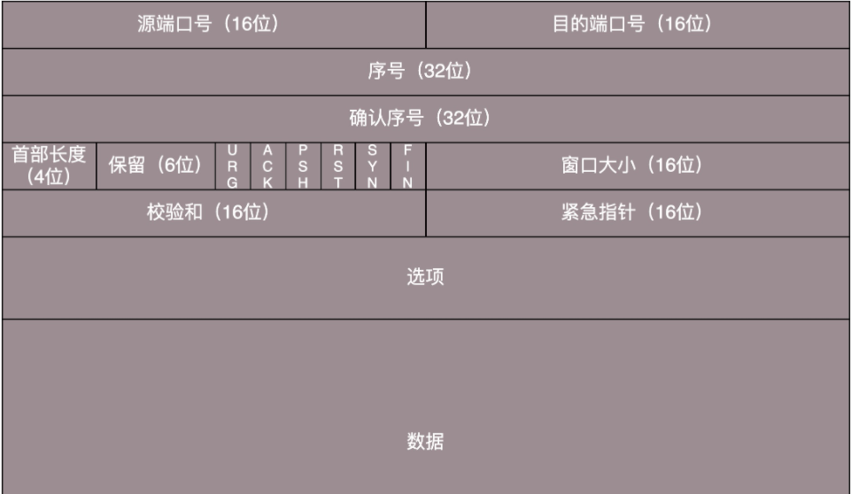

# **如何使用UDP实现TCP？**

## TCP 的特点？

面向连接

TCP 和 UDP 是传输层里面比较重要的两个协议。大部分面试的时候都会问到两者的区别。而大部分都会两句，比如 TCP 是面向连接的，UDP 是面向无连接。

那什么是面向连接？

TCP 三次握手是我们常常念叨和背诵的。而在这三次握手成功后，就是建立连接成功。

那什么又叫**面向**呢？

我们也常听到面向对象编程、面向切面编程、面向服务编程。那到底什么是面向？

在我看来 面向 就是遵循一定的协议、规范、数据结构等来做一系列事情。

比如**面向连接**，就是为了在客户端和服务端维护连接，而建立一定的数据结构来维护双方交互的状态，用这样的数据来保证所谓的面向连接的特性。

知道了 TCP 的是用三次握手来建立连接，那我们是否可以让 UDP 也发三个包来模拟 TCP 建立连接？可以是可以，但是如果只是建立，而不是面向连接，其实意义不大。

那 TCP 面向连接做了哪些事情？

TCP 提供**可靠交付**，通过 TCP 连接传输的数据，可以无差错、不丢失、不重复、并且按序到达。而 UDP 继承了 IP 包的特性，不保证不丢失，不保证按顺序到达。

- 面向字节流

TCP 是面向字节流，所谓字节流，就是发的是一个流，没头没尾。TCP 自己维护流状态。

UDP 基于 IP 数据报，一个一个地发，一个一个地收。

- 拥塞控制

TCP 拥有拥塞控制，如果包丢弃了或者网络环境不好了，就会根据网络情况自行控制自己的行为，看下是发快点还是发慢点。

UDP 则没有这么智能了， 你让我发，我就发呗，反正是你让我发的，其他的一概不管~

- 有状态服务

TCP 是一个有状态的服务，有状态可以理解为：我记录了哪些发送了，哪些没有发送，哪些接收到了，哪些没接收到，应该接收哪个了，一点差错都不行。TCP 干的事情可真多！

而 UDP 则不是有状态的服务，我只管发，其他的就交给接收端吧，有点任性是吧？

## 如何让 UDP 实现 TCP 功能？

建立连接上面已经讲到了，三次握手和四次握手，UDP 也可以模拟去做。

那下面还有几个问题：

- 顺序问题
- 丢包问题
- 流量控制
- 拥塞控制

其实如果你能把这些结构讲清楚，就已经理解了 TCP 的核心功能。下面我还是用大白话的方式来讲解上面的四个问题。

**顺序问题和丢包问题**可以利用**确认**与**重发**的机制。假如包收到了，可以做一个确认，发送一个 ACK 给发送端，告诉他我收到了。假如有的包提前到了，就缓存着。假如有包丢失了，就可以超时重试。超时重试不宜过短，时间必须大于往返时间 RTT，否则会引起不必要的重传。也不宜过长，如果超时时间过长，访问就变慢了。那怎么确定这个时间，可以通过采样 RTT 的时间，进行加权平均。还需要根据网络状况，动态变化。可以了解下自适应重传算法。

**流量控制**就是根据网络情况调整发包的速率。利用的是滑动窗口。在对于包的确认中，同时会携带一个窗口的大小，只要利用好这个窗口大小，就能很好地调整发包速率，发的报文段不要超过窗口的大小就 OK。

**拥塞控制**主要用来避免包丢失和超时重传，如果出现了这两种现象，就说明发的速率太快了。那最开始怎么知道发送速率呢？其实开始时只发送一个报文段数据，如果收到一个确认，则倍增报文段，依次类推。当发现超时重传时，就又回到只发送一个报文段的情况，这个就是慢启动，这种方式不合适。其实还有一种快速重传算法，简单来说就是拥塞窗口减半，后续线性增速。针对于算法怎么实现的，这里就不展开讲述了。